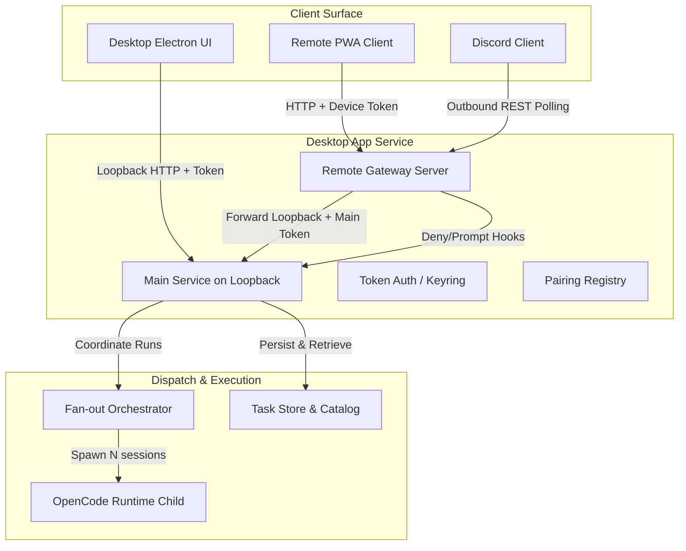

# Architecture Audit: "As-Is" System

This document provides a comprehensive technical audit of the current state of **Cowork GHC**'s agent harness, remote gateway (PWA + Discord), and dispatch/fan-out orchestration system as of July 15, 2026.

---

## 1. Architectural Overview

Cowork GHC operates as a packaged local-first Windows desktop application. The architecture divides responsibility between the user interface, a background service, and isolated runtimes:

---

## 2. Key Modules & Directory Structure

- **`core/contracts/src/dispatch.ts`**: Pure TypeScript contracts defining the data structure for `TaskDefinition`, `AgentDefinition`, `LoopPolicy`, and validation helpers (e.g., `validateTaskDefinition`, `isNarrowingPreset`).
- **`service/src/remote-gateway/`**:
  - `pairing.ts`: Manages device authorization registry, temporary pairing codes, and SHA-256 device token verification.
  - `gateway.ts`: Separate server running alongside the main loopback service. Filters and forwards allowed requests via a reverse proxy.
  - `pwa.ts`: Inlines the complete single-file remote HTML/CSS/JS interface, served by the gateway.
  - `remote-router.ts`: Mounts API endpoints for `/v1/remote` settings panel, pairing-code display, and revocation.
- **`service/src/remote-gateway/discord/`**:
  - `adapter.ts`: Discord communication layer. Sanitizes, filters, and formats outbound notifications, enforces allowlisted user actions, and blocks file-write approvals.
  - `rest-transport.ts`: Polling client executing HTTP requests to Discord's `/messages` API without persistent WebSocket connections.
- **`service/src/agents/` & `service/src/tasks/`**:
  - `catalog.ts` & `store.ts`: CRUD and catalog stores for agents and tasks. Persists records to the local filesystem and enforces narrowing-only security validation.
- **`service/src/dispatchers/fanout.ts`**:
  - Coordinates concurrent execution of multi-agent task branches, aggregates branch statuses honestly, and handles group cancellation.

---

## 3. Data & Control Flow

### A. Pairing Flow
1. Desktop composer issues `/remote` command, requesting a pairing code.
2. The `PairingRegistry` issues an 8-character single-use code with a 2-minute TTL.
3. The PWA client sends a `POST /pair` containing the code and a device name.
4. If valid, the code is consumed, and the registry responds with a unique bearer device token (SHA-256 digested server-side).

### B. Remote Request Proxying
1. The remote PWA sends a `GET` request to `http://<LAN_IP>:<Port>/api/conversations` with a device token.
2. The `RemoteGateway` verifies the token in constant-time.
3. The gateway proxies the request to the main loopback service, replacing the device token with the internal `mainClientToken`.
4. The loopback service returns the data, which the gateway streams back to the client.

### C. Fan-Out Orchestration
1. A task is initiated with multiple branches.
2. `FanOutOrchestrator` splits the task into branch plans, verifying agent IDs against the catalog.
3. Active threads are pooled using bounded concurrency (capped at `maxConcurrency` or hard-capped at 5).
4. Each branch triggers an isolated child execution session.
5. If one branch fails, the group status aggregates to `partial` or `errored`, avoiding fake success reports.

---

## 4. Dependencies
- **Node.js Built-ins**: `node:crypto` (timing-safe comparisons, digests), `node:http` (gateway reverse proxy, Discord transport).
- **`qrcode` (1.5.4)**: Generates SVG codes for fast pairing via camera.
- **`@cowork-ghc/contracts`**: Internal type packages.

---

## 5. Deployment & Runtime Assumptions
- **Local Network (LAN)**: Demands same-subnet connectivity. Mode `CGHC_REMOTE_LAN` is unencrypted (HTTP) and relies on user safety.
- **Outbound HTTP**: Discord polling requires outbound internet access (no inbound ports needed).
- **In-Memory Store**: Device tokens are stored in-memory per-launch. Restarting Cowork GHC revokes all devices, requiring re-pairing.

---

## 6. Gaps vs. Original Idea & Known Risks

| Requirement / Idea Component | Current Implementation ("As-Is") | Gap / Risk | Reference |
|---|---|---|---|
| **Secure Keyring Persistence** | In-memory only. | Device tokens lost on app restart; forces constant re-pairing. | `agent-harness-plan.md` Task 2.1 |
| **TLS & Cert Pinning for LAN** | HTTP only when `CGHC_REMOTE_LAN=1`. | Transport is sent in plain text, making it vulnerable to local eavesdropping. | `agent-harness-plan.md` Task 2.2 |
| **Outbound Discord WebSocket** | Polling REST client. | Real-time delay up to poll interval (4 seconds); higher API load. | `rest-transport.ts` |
| **Live Runtime E2E verification** | Tested with unit-mocks. | Child OpenCode runtime integration for tool consumption is unverified. | `current-status.md` Limitations |
| **D1-D4 Integration** | Registry slots only. | True production gateway, key rotation, and RAG are missing. | `roadmap.md` WAITING |
| **Slash Commands / Skills** | Only `/remote` is hardcoded. | No generic slash command registry; custom prompts and skills cannot be called via `/` commands. | `app-shell.ts` line 2057 |

