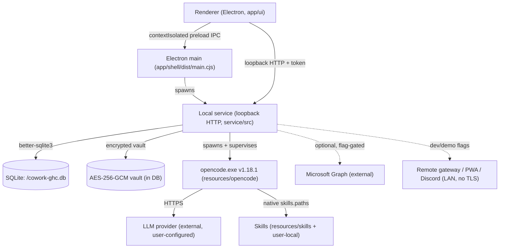
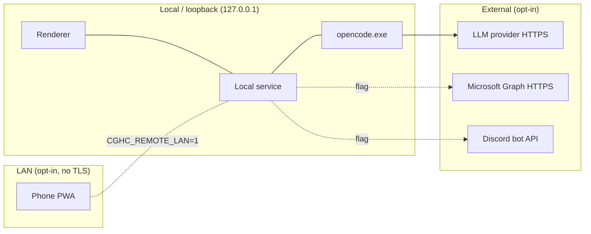
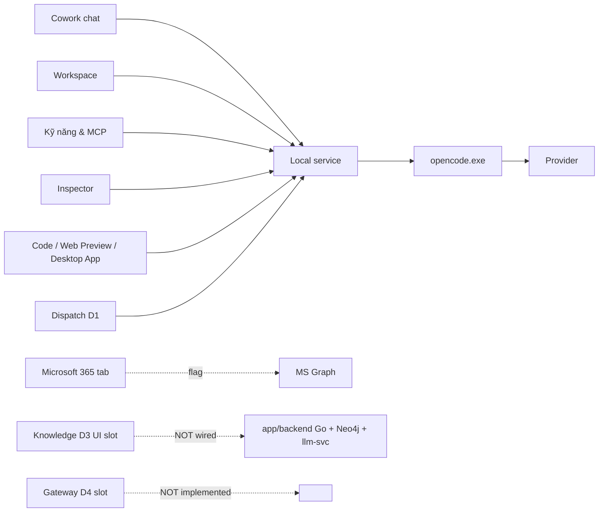

# Dependencies & Services Inventory

Canonical, code-derived inventory of every language, runtime, process, database, network egress,
and third-party dependency in Cowork GHC. Source of truth = Git HEAD + code, not marketing claims.

Status taxonomy used throughout:

- **IMPLEMENTED** — code exists and is exercised by the running app.
- **WIRED, UNVERIFIED** — composed/reachable but not verified against real dependencies/packaged.
- **PARTIAL** — a real subset works; documented gaps remain.
- **PLACEHOLDER / DORMANT** — code exists but is not composed into the running app.
- **NOT IMPLEMENTED / DEFERRED** — intentionally not built yet.
- **DEV/TEST-ONLY** — used only in development or CI, never by the packaged end-user app.
- **EXTERNAL** — a cloud/product dependency the user opts into.

## 1. Languages & toolchains

| Language | Where | Built by | Bundled in package? | Status |
|---|---|---|---|---|
| TypeScript (ESM) | `app/shell`, `app/ui`, `core/contracts`, `service`, `runtime` | `tsc -b`, Vite, esbuild | Yes (asar + `main.cjs`) | IMPLEMENTED — the whole running app |
| Go 1.25 | `app/backend` (`github.com/rad-system/m365-knowledge-graph`) | `tools/native-build/build-backend.bat` (needs Go) | **No** | PLACEHOLDER/DORMANT (see §5) |
| Rust (edition 2021) | `app/llm-svc` (`llm-svc`) | `tools/native-build/build-llm-svc*.bat` (needs Rust+MSVC) | **No** | PLACEHOLDER/DORMANT (see §5) |
| Protobuf/gRPC | `app/backend/proto/llmsvc.proto`, `app/llm-svc/proto/llmsvc.proto` | `protoc` (vendored in `.tools/protoc`) | No | DEV-ONLY codegen |

Environment observed on the current dev machine: Node 24.15, npm 11.17, Python 3.11.8, Rust 1.96.
**Go is not installed** (neither Bash nor Windows PATH) and **Java is not installed** — so the Go
backend cannot currently be built here, and Neo4j (which needs a JRE) cannot run here. Docker 29.4 is
present but only used by dev/test harnesses (§6).

## 2. Process architecture (packaged app)

The **only** child process the packaged app spawns today is `opencode.exe`. Everything else
(SQLite, vault) is in-process. The D3 knowledge stack that *would* spawn Postgres/Neo4j/JRE/Go/Rust
children is not composed (§5).

## 3. Data & persistence

| Store | Location | Owner | Status |
|---|---|---|---|
| SQLite (source of truth) | `<userData>/cowork-ghc.db` via `service/src/db/` | service | IMPLEMENTED — user/settings/provider profiles/encrypted secrets/conversations/messages/Skill state/MCP config |
| Encrypted vault | inside the DB (`vault-crypto.ts`, `vault-credential-store.ts`) | service | IMPLEMENTED — scrypt KEK wraps AES-256-GCM master key held only in memory after unlock; no plaintext secret in DB/JSON/renderer/logs |
| `@napi-rs/keyring` (Windows credential) | OS keyring | service (legacy) | PARTIAL — retained for Wave-0A migration consumers (ADR 0007 §6); the vault is authoritative |
| Runtime temp | `.runtime/` (pids/logs/state/temp) | scripts + `tools/app` | IMPLEMENTED |
| Packaged profile | `%APPDATA%\Cowork GHC` (Electron userData, driven by `productName`) | Electron | IMPLEMENTED — unchanged by the `coworkghc.exe` rename |

> README.md historically claimed "no SQL / Windows Credential Manager". That is **stale** — SQLite +
> encrypted vault is authoritative. `tools/dev/set-provider-key.bat` is a legacy OS-keyring entry.

## 4. Network egress & trust boundaries

- **Loopback only by default.** The service binds `127.0.0.1` with a token guard; the renderer never
  touches the DB or secret bytes.
- **SSRF policy** (`compose-service.ts`) gates all outbound targets: HTTPS-only, private/loopback/
  link-local/cloud-metadata blocked. Dev opt-ins: `COWORK_GHC_DEV_ALLOW_LOOPBACK_HTTP=1` (loopback
  http only), `COWORK_GHC_E2E_MOCK_LLM_BASE_URL` (mock LLM). One shared policy instance currently
  serves provider/MCP/MS365/Power-Automate — see `known-limitations.md` (SSRF scope-split pending).
- **External egress is always opt-in**: the LLM provider (user-configured endpoint/token), Microsoft
  Graph (flag + manual token/device-code), Discord/remote (dev/demo flags, LAN has no TLS yet).
- **No telemetry/analytics SDK, no CDN, no remote assets.** Local telemetry is SQLite counters with
  an allowlist and a Settings toggle; no network egress.

## 5. D-track integration truth (D1–D4)

| Track | What is in the repo | Composed into running app? | Status |
|---|---|---|---|
| **D1 Dispatch** | `service/src/dispatchers/`, `tasks/` (loop runner, fan-out, board, `/dispatch`) | Yes | PARTIAL — unit/integration verified with fake seams; **no packaged/live fan-out** with a real OpenCode child (Checkpoint 5 open) |
| **D2 Microsoft 365** | `service/src/ms365/*`, `credential/m365-*`, UI tab | Yes | PARTIAL — manual-token chat + history + in-tab permission cards; device-code OAuth gated (no Azure app reg); **no live tenant/packaged run** |
| **D3 Knowledge/RAG/Graph** | `app/backend` (Go), `app/llm-svc` (Rust), `service/src/knowledge/**` | **No** — nothing outside `service/src/knowledge/` imports it; no enable flag; not in `extraResources` | **PLACEHOLDER/DORMANT** — substantial code, unit-tested against fakes, **never run against real binaries**, **not bundled** |
| **D4 Gateway** | mount boundary only | Boundary only | NOT IMPLEMENTED (intentional) |

### D3 detail (the largest hidden surface)

The Go module `app/backend` is far larger than "local import → graph": it contains api, auth
(Entra/JWT), connectors (OneDrive/Teams), embedding (gRPC → llm-svc), feedback, finetuning
(Anthropic client), graph (Neo4j store/query/migration/traversal), metadata (Postgres via `lib/pq`),
nlp, parsers (docx/pptx/xlsx/text/pdf), retrieval, scheduler, websocket. Go deps of note:
`neo4j/neo4j-go-driver/v5`, `lib/pq` (Postgres), `mattn/go-sqlite3`, `golang-jwt/jwt/v5`,
`ledongthuc/pdf`, `xuri/excelize/v2`, `google.golang.org/grpc`.

The Rust `app/llm-svc` is a **local** embedding/inference service: `tonic`/`prost` (gRPC), `ort`
(ONNX Runtime CPU), `tokenizers`, `llama-gguf` (pure-Rust GGUF, no C++). It is designed to run
locally, not call a cloud model.

The TypeScript side (`service/src/knowledge/stack/`) already implements a **local-first bring-up**:
`provisioning.ts` downloads + checksum-verifies portable Windows binaries for PostgreSQL, Neo4j
Community, and a Temurin JRE; `stack-initializer.ts` runs `initdb`/`neo4j-admin`/`psql`/
`cypher-shell` to create the cluster and apply migrations; `stack-supervisor.ts` supervises the four
children (Postgres, Neo4j, llm-svc, Go backend) on loopback. **Every one of these files carries a
header stating it has NOT been run against real Windows/Postgres/Neo4j binaries** — authored and
unit-tested against fakes. And none of it is wired into `compose-service.ts` or shipped in the
package. See `local-first-strategy.md`.

## 6. Docker

| Artifact | Purpose | Status |
|---|---|---|
| `app/backend/Dockerfile` | `golang:1.22-alpine` → linux binary on `alpine` | **DEV/TEST-ONLY** — a Linux build/run of the Go backend; not the Windows runtime path |
| `tools/system-test/Dockerfile` + `run.sh` | containerized system-test harness | **DEV/TEST-ONLY** |

**Docker is not a runtime dependency of the packaged Windows app** and must never become one. The
chosen D3 runtime path is downloaded portable Windows binaries + loopback supervision, not
containers (see `local-first-strategy.md`).

## 7. Key third-party runtime dependencies (packaged app)

| Dependency | Role | License | Notes |
|---|---|---|---|
| `electron` ^33 | desktop shell | MIT | |
| `better-sqlite3` 12.x | embedded DB | MIT | native addon; `asarUnpack` + electron-rebuild for the Electron ABI |
| `opencode-ai` (opencode.exe) | agent runtime | (vendor) | **pinned v1.18.1**, fallback 1.17.20; ~157 MB, shipped via `extraResources`, spawned from disk |
| `@napi-rs/keyring` | legacy credential | MIT | migration-only |
| `qrcode` | remote pairing QR | MIT | dev/demo remote surface |

Would-be D3 externals (not bundled today): **Neo4j Community — GPLv3** (redistribution constraint),
**PostgreSQL — PostgreSQL License** (permissive), **Temurin JRE — GPLv2+CE**. The Neo4j license is a
material factor for any "bundle it" decision (see `local-first-strategy.md §Neo4j`).

## 8. Feature → service map

## 9. Summary of honesty corrections vs older docs

- D3 is **not** "does not implement" (old current-status line) — it is a large, dormant, unverified
  subsystem. D1 is implemented (not just a seam); D2 is partial. Update `current-status.md`.
- Persistence is **SQLite + encrypted vault**, not "no SQL / Windows Credential Manager" (README).
- Docker is **dev/test-only**, never a packaged-app dependency.
- The packaged executable is now **`coworkghc.exe`**; display name stays **Cowork GHC**.
