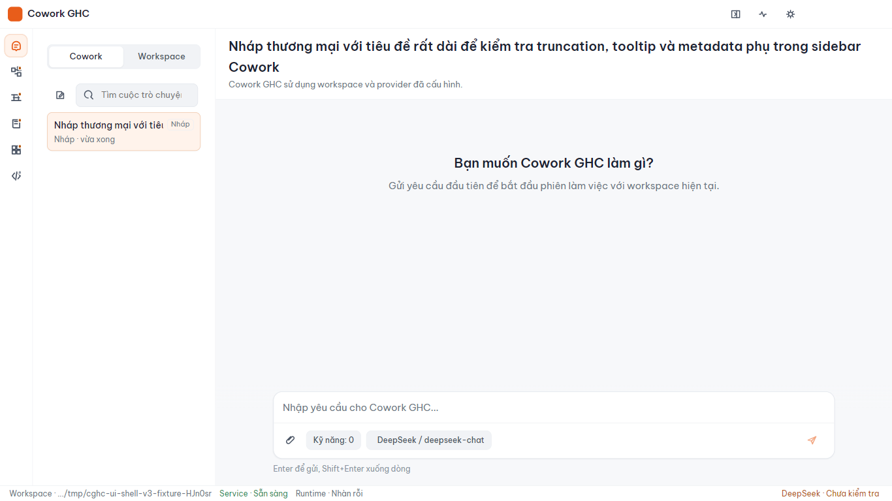
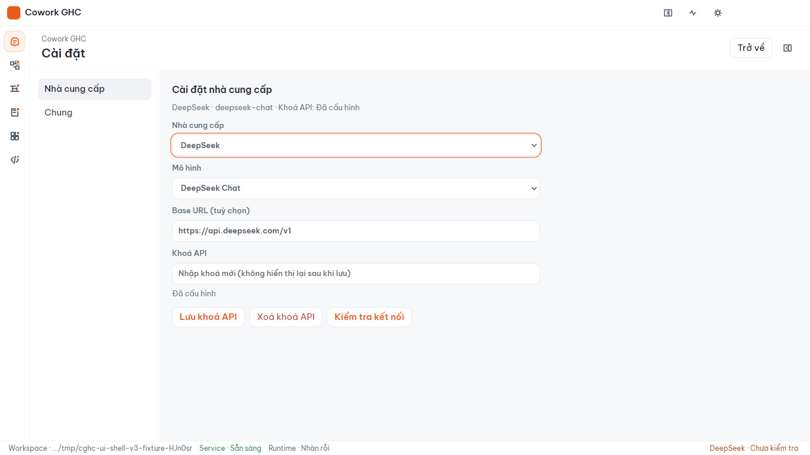
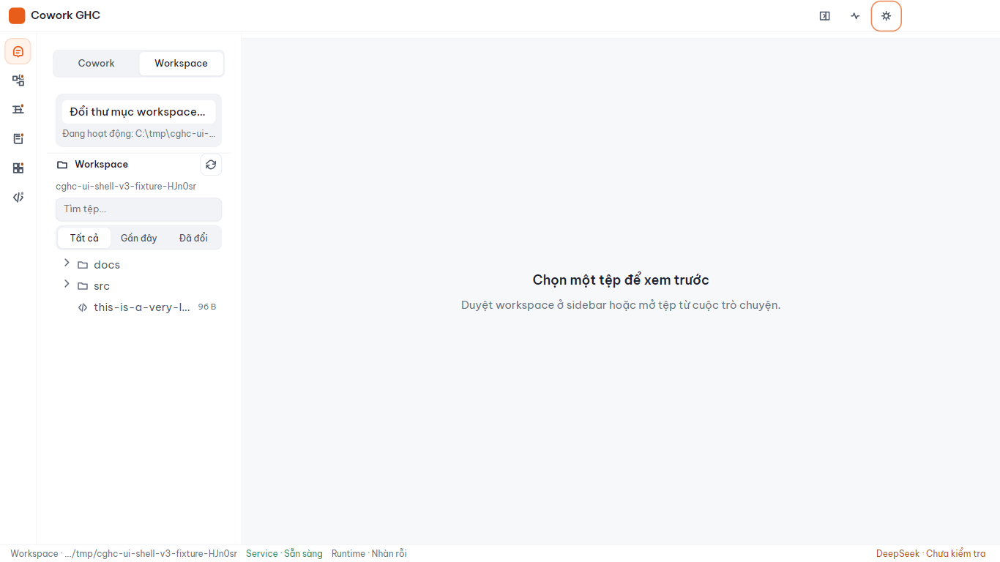
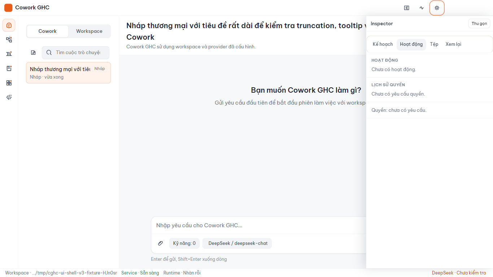

# Hướng dẫn demo Cowork GHC

Dùng cho funding/demo review. Acceptance: [demo-acceptance.md](../quality/demo-acceptance.md).

## Chuẩn bị (5 phút)

```bat
scripts\init.bat
scripts\build.bat
```

Nếu cần profile sạch (giữ API key trong keyring):

```bat
scripts\demo-reset.bat
scripts\start.bat
```

Cấu hình provider trong **Settings → Nhà cung cấp** hoặc chạy `scripts\set-provider-key.bat`.

## Hành trình demo

### 1. Launch

Chạy `scripts\start.bat`. Xác nhận màn hình New Chat sạch.



### 2. Provider profile

Mở Settings (icon bánh răng). Tạo hoặc chọn profile; nhập API key nếu thiếu; **Kiểm tra kết nối**.



### 3. Workspace

Chọn workspace từ sidebar. Duyệt file text trong navigator.



### 4. Chat + attachment

Prompt mẫu:

```text
Hãy đọc file đính kèm và tóm tắt nội dung trong 3 gạch đầu dòng.
```

Đính kèm file `.txt` nhỏ từ workspace (ví dụ `notes.txt`).

### 5. File create + permission

Prompt mẫu:

```text
Tạo file demo-output.txt trong workspace với nội dung "Cowork GHC demo OK" và xác nhận đường dẫn.
```

Chọn **Allow** trên modal permission. Mở File Work Review / inspector để xem diff.



### 6. History + relaunch

- Mở conversation từ sidebar (history).
- `scripts\stop.bat` rồi `scripts\start.bat`.
- Xác nhận history còn; startup vẫn New Chat sạch.

## Prompt dự phòng (modify)

```text
Sửa demo-output.txt: thêm dòng thứ hai "Updated during demo".
```

## Kết thúc

```bat
scripts\stop.bat
```

Kiểm tra không còn orphan `Cowork GHC` / `opencode` process.

## Giới hạn cần nói với reviewer

- D1–D4: **Sắp có** — không demo.
- File delete trong File Work Review: chưa tin cậy.
- Skills: chỉ enable/disable local files; chưa editor trong app.
- Attachments: text only; chưa drag-drop.

Chi tiết: [known-limitations.md](../quality/known-limitations.md).
