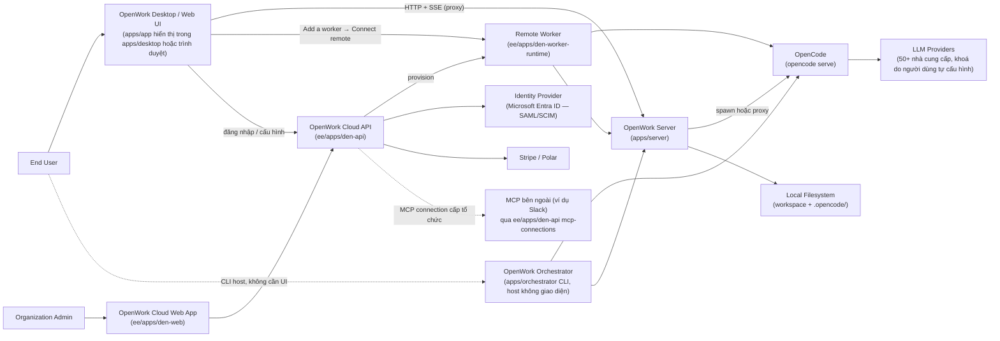
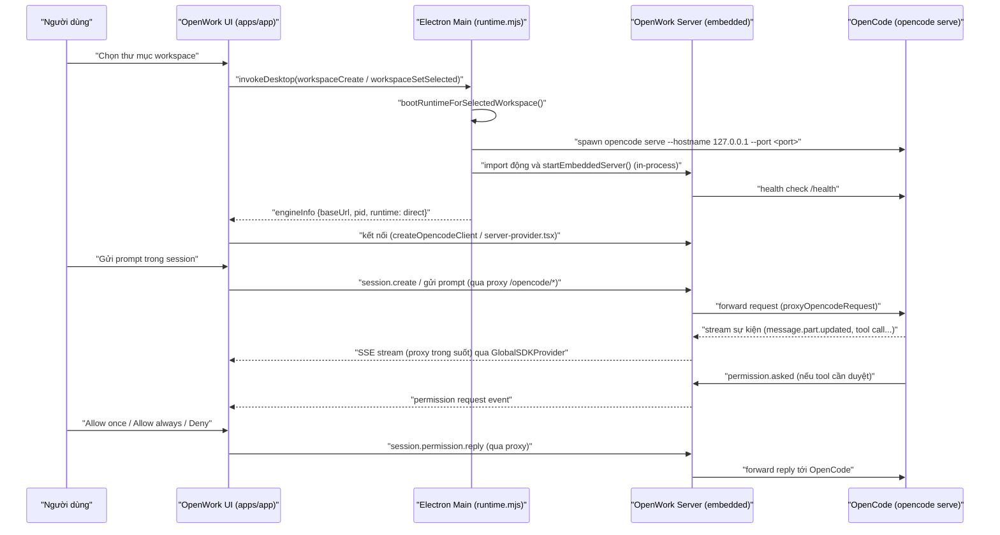
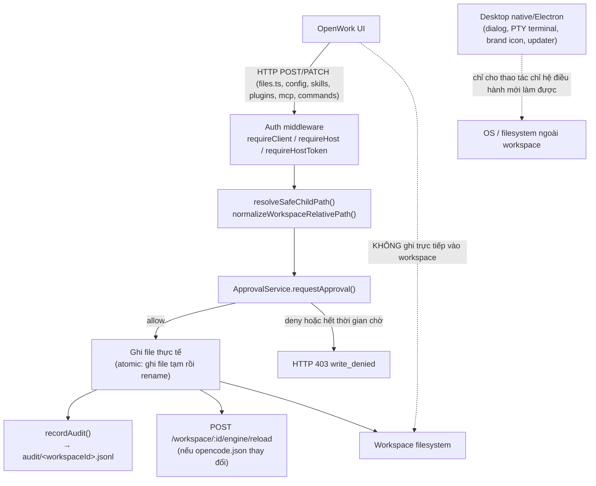
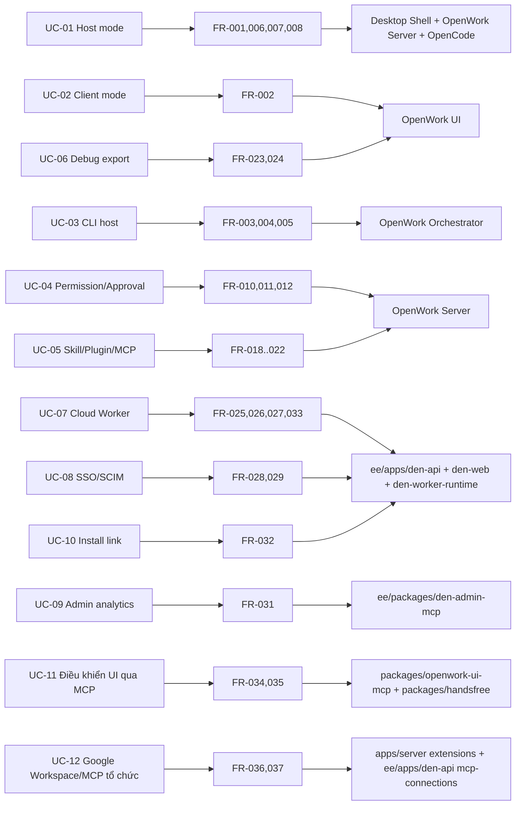

# OpenWork — Requirement và Basic Design

## 1. Thông tin tài liệu

Tài liệu này được tạo bằng cách khảo sát trực tiếp mã nguồn và tài liệu nội bộ của repository `different-ai/openwork` tại branch `dev`, commit `00190e5020476478576ad21c66c1abc20d756677`. Mục tiêu là cung cấp một bản mô tả yêu cầu (Requirement) và thiết kế cơ bản (Basic Design) đủ để một kỹ sư mới có thể định hướng trong toàn bộ hệ thống mà không cần đọc lại toàn bộ repository.

Tài liệu được soạn tự động theo phương pháp: đọc `AGENTS.md`, `README.md`, các tài liệu trong `docs/`, `package.json`/`pnpm-workspace.yaml`/`turbo.json`, và khảo sát trực tiếp mã nguồn của `apps/*`, `packages/*`, `ee/*` bằng các agent tìm kiếm chuyên biệt. Mọi nhận định quan trọng đều kèm theo đường dẫn file làm nguồn xác nhận.

> **Mục lục nhanh**
>
> **Phần mở đầu** — [2. Tóm tắt điều hành](#2-tóm-tắt-điều-hành) · [3. Phạm vi và phương pháp phân tích](#3-phạm-vi-và-phương-pháp-phân-tích)
>
> **Phần I — Requirement** — [4. Bối cảnh](#4-bối-cảnh-và-vấn-đề) · [5. Mục tiêu](#5-mục-tiêu-hệ-thống) · [6. Phạm vi sản phẩm](#6-phạm-vi-sản-phẩm) · [7. Actor](#7-actor-và-hệ-thống-bên-ngoài) · [8. Use case](#8-use-case-tổng-quan) · [9. Functional Requirements](#9-functional-requirements) · [10. Non-functional Requirements](#10-non-functional-requirements) · [11. Business Rules](#11-business-rules-và-system-rules) · [12. Constraints](#12-constraints) · [13. Ma trận truy vết](#13-ma-trận-truy-vết-requirement)
>
> **Phần II — Basic Design** — [14. Nguyên tắc kiến trúc](#14-nguyên-tắc-kiến-trúc) · [15. System Context](#15-system-context) (Sơ đồ 1) · [16. Kiến trúc tổng thể](#16-kiến-trúc-tổng-thể) (Sơ đồ 2) · [17. Bản đồ application/package](#17-bản-đồ-application-và-package) · [18. Runtime Modes](#18-runtime-modes) · [19. Thiết kế thành phần](#19-thiết-kế-các-thành-phần) · [20. Luồng xử lý chính](#20-các-luồng-xử-lý-chính) · [Sơ đồ 3](#sơ-đồ-3--host-mode-runtime-flow) · [Sơ đồ 4](#sơ-đồ-4--clientremote-mode-runtime-flow) · [Sơ đồ 5](#sơ-đồ-5--filesystem-mutation-flow) · [Sơ đồ 6](#sơ-đồ-6--requirement-traceability) · [21. API/Event/IPC](#21-api-event-và-ipc-boundaries) · [22. Dữ liệu & cấu hình](#22-dữ-liệu-trạng-thái-và-cấu-hình) · [23. Security](#23-security-và-permission-model) · [24. Logging/Audit](#24-logging-audit-debugging-và-observability) · [25. Error Handling](#25-error-handling-và-recovery) · [26. Build/Deploy](#26-build-deployment-và-release) · [27. Extension Points](#27-extension-points) · [28. Trade-offs](#28-design-decisions-và-trade-offs) · [29. Known Gaps](#29-known-gaps-technical-debt-và-open-questions) · [30. Kết luận](#30-kết-luận)
>
> **Phụ lục** — [A. Nguồn](#phụ-lục-a--danh-sách-nguồn-quan-trọng) · [B. Thuật ngữ](#phụ-lục-b--thuật-ngữ) · [C. Traceability Matrix](#phụ-lục-c--requirement-traceability-matrix)

## 2. Tóm tắt điều hành

OpenWork là một ứng dụng desktop mã nguồn mở (macOS, Windows, Linux) cho phép người dùng thực hiện công việc cùng AI agent trên tệp tin của chính họ, được mô tả là "the open source alternative to Claude Cowork and Codex" (`README.md`). Hệ thống được xây dựng trên nền **OpenCode** — một agent runtime bên ngoài mà OpenWork điều phối, không tự triển khai lại (`AGENTS.md`: "OpenWork is powered by OpenCode").

Về mặt kiến trúc, OpenWork tách thành bốn lớp rõ ràng và đã được xác nhận trong mã nguồn:

1. **OpenWork UI** (`apps/app`) — một ứng dụng React 19 + Vite thuần, không phụ thuộc vào runtime desktop cụ thể, giao tiếp với runtime hoàn toàn qua HTTP/SSE.
2. **Desktop shell** (`apps/desktop`) — vỏ bọc **Electron** (không còn là Tauri như README mô tả — xem mục 18 và Phụ lục về khoảng trống tài liệu) chịu trách nhiệm khởi động runtime cục bộ, các thao tác chỉ hệ điều hành mới làm được (folder picker, PTY terminal, auto-update, tray/menu), và expose các thao tác đó qua IPC.
3. **OpenWork Server** (`apps/server`, package `openwork-server`) — một API server "filesystem-backed" (`apps/server/README.md`) sở hữu toàn bộ trạng thái workspace, cấu hình `.opencode/`, quyền (permission/approval), audit log, và đóng vai trò proxy trong suốt (transparent reverse proxy) cho OpenCode.
4. **OpenWork Orchestrator** (`apps/orchestrator`, package `openwork-orchestrator`) — một CLI host cho phép chạy toàn bộ stack (OpenCode + OpenWork Server) trên máy chủ không có giao diện desktop, dùng lệnh `openwork start --workspace <path> --approval auto`.

Ngoài phần mã nguồn mở (MIT), repository còn chứa thư mục `ee/` (Functional Source License — FSL-1.1-MIT, xem `ee/LICENSE`) triển khai **OpenWork Cloud** ("Den"): một control plane (`ee/apps/den-api`), web app khởi chạy Cloud Worker (`ee/apps/den-web`), và runtime chạy trên các container từ xa (`ee/apps/den-worker-runtime`), cho phép người dùng mua và kết nối tới một "worker" chạy OpenCode + OpenWork Server trên hạ tầng đám mây thay vì máy cục bộ.

Tài liệu này trình bày chi tiết yêu cầu (Phần I) và thiết kế (Phần II) của toàn bộ hệ thống trên, đồng thời chỉ rõ những phần thiết kế mới ở dạng đề xuất/nháp (ví dụ marketplace capability, memory bank) chưa được xác nhận là đã triển khai đầy đủ.

## 3. Phạm vi và phương pháp phân tích

### 3.1 Phạm vi

Tài liệu bao phủ: toàn bộ `apps/` (app, desktop, server, orchestrator, installer, ui-demo), `packages/` (types, ui, openwork-bootstrap, openwork-ui-mcp, install-config, handsfree, email, docs), `ee/apps` và `ee/packages` (den-api, den-controller, den-web, den-worker-proxy, den-worker-runtime, inference, landing, den-db, den-admin-mcp, utils), và các tài liệu thiết kế trong `docs/` ở gốc repository. Không bao phủ chi tiết mã nguồn ở mức class/function (Low-Level Design), không bao phủ nội dung `translated_readmes/`, `changelog/`, hay các test case cụ thể ngoài việc dùng chúng làm bằng chứng hành vi.

### 3.2 Nguồn đã khảo sát

- `AGENTS.md`, `README.md`, `SECURITY.md`, `LICENSE`, `ee/LICENSE`
- `pnpm-workspace.yaml`, `turbo.json`, `package.json` (gốc), `constants.json`
- `docs/marketplace-capabilities-architecture.md`, `docs/memory-bank-architecture.md`, `docs/desktop-app-policies.md`, `docs/enterprise-plan-gating.md`, `docs/extensions-manifest-foundation.md`, `docs/single-org-mode-plan.md`, `docs/org-install-links.md`, `docs/microsoft-entra-sso-scim.md`, `docs/google-workspace-oauth-verification.md`, `docs/mcp-ui-control-profile.md`, `docs/aws-eks-helm.md`, `docs/azure-aks-helm.md`, `docs/gcp-gke-helm.md`, `docs/support/enterprise-network-doctor.md`
- `apps/app/src/react-app/ARCHITECTURE.md` (tài liệu kiến trúc thực sự duy nhất có tên "ARCHITECTURE.md" tồn tại trong repo, chỉ mô tả `apps/app`)
- `apps/server/README.md`, `apps/orchestrator/README.md`, `apps/installer/README.md`
- `ee/apps/den-api/README.md`, `ee/apps/den-controller/README.md`, `ee/apps/den-web/README.md`, `ee/apps/den-worker-runtime/README.md`, `ee/apps/landing/README.md`, `ee/packages/den-admin-mcp/README.md`, `ee/packages/den-db/README.md`
- `packages/handsfree/README.md`, `packages/openwork-bootstrap/README.md`, `packages/ui/README.md`
- Mã nguồn thực tế của tất cả các app/package nêu trên (routes, IPC handlers, Rust~Electron main process, stores, cli entry points) — khảo sát qua các agent tìm kiếm chuyên biệt, trích dẫn theo file cụ thể trong toàn bộ tài liệu.
- `evals/README.md` (cơ chế kiểm thử hành vi thực tế qua "fraimz")

### 3.3 Quy ước mức độ xác nhận

| Mức | Ý nghĩa |
| --- | --- |
| **Đã xác nhận** | Có bằng chứng trực tiếp trong mã nguồn hoặc tài liệu, trích dẫn kèm đường dẫn file/symbol cụ thể. |
| **Suy luận có cơ sở** | Được suy ra từ việc đối chiếu nhiều thành phần (ví dụ: không tìm thấy đường ghi file trực tiếp từ UI, kết hợp với việc mọi route ghi file đều nằm trong `apps/server`, suy ra nguyên tắc "server-first"). |
| **Chưa xác định** | Có được nhắc tới (trong README, tên file, hoặc tài liệu thiết kế) nhưng không tìm thấy bằng chứng triển khai đầy đủ, hoặc tài liệu thiết kế ghi rõ là "draft/plan" chưa merge. |

### 3.4 Giới hạn của tài liệu

- `README.md` và `AGENTS.md` yêu cầu người đóng góp đọc thêm `VISION.md`, `PRINCIPLES.md`, `PRODUCT.md`, `ARCHITECTURE.md` (ở gốc repo) và `TRIAGE.md`, nhưng các file này **không tồn tại** trong repository tại thời điểm khảo sát (chỉ có `apps/app/src/react-app/ARCHITECTURE.md`, phạm vi giới hạn ở `apps/app`). Đây là khoảng trống tài liệu, không phải giả định của người viết tài liệu này.
- README mô tả desktop shell dùng Tauri (Rust, `src-tauri/capabilities/default.json`, Tauri dialog plugin), nhưng mã nguồn `apps/desktop` hiện tại đã loại bỏ hoàn toàn Tauri và chuyển sang Electron (xem mục 18.3 và CON-004). Tài liệu này mô tả theo **hiện trạng mã nguồn (Electron)**, có ghi chú khác biệt so với README.
- Một số tài liệu trong `docs/` là **thiết kế đề xuất chưa triển khai đầy đủ** (đặc biệt `marketplace-capabilities-architecture.md` — "design note", và `memory-bank-architecture.md` — "Draft for scoping"). Tài liệu này trích dẫn chúng như định hướng thiết kế tương lai, không coi là tính năng đã hoạt động.
- Phạm vi khảo sát không bao gồm việc chạy thử ứng dụng thực tế (build/run); mọi kết luận dựa trên đọc mã tĩnh.

---

# Phần I — Requirement

## 4. Bối cảnh và vấn đề

`README.md` nêu rõ động lực: các CLI/GUI hiện có cho OpenCode ("Current CLI and GUIs for opencode") được thiết kế xoay quanh nhà phát triển — tập trung vào file diff, tên tool, khó mở rộng nếu không "phơi bày" ra CLI. OpenWork được định vị là một control surface thực dụng cho công việc dùng agent ("a practical control surface for agentic work", `AGENTS.md`), hướng tới người dùng phần lớn không rành kỹ thuật (`AGENTS.md`: "Assume most end users of OpenWork are non-technical").

Ba vấn đề cụ thể được nêu (README, mục "Why"):
- **Extensible**: skill và plugin OpenCode phải là các module cài đặt được, không cần biết CLI.
- **Auditable**: hệ thống phải cho thấy "cái gì đã xảy ra, khi nào, và tại sao".
- **Permissioned**: truy cập vào các luồng có đặc quyền phải được kiểm soát.
- **Local/Remote**: chạy cục bộ nhưng vẫn kết nối được máy chủ từ xa khi cần.

## 5. Mục tiêu hệ thống

Theo `AGENTS.md` (mục "Core Philosophy") và `README.md`:

- **Local-first, cloud-ready**: chạy trên máy người dùng chỉ với một cú nhấp, gửi tin nhắn ngay lập tức; kết nối tới cloud khi cần.
- **Server-consumption first**: ứng dụng client phải tiêu thụ bề mặt API của OpenWork Server (tự host hoặc hosted), không tự phát minh hành vi song song.
- **Composable**: dùng desktop app, connector nhắn tin, hoặc server mode tùy theo nhu cầu, không khóa chặt vào một cách dùng.
- **Ejectable**: vì chạy trên OpenCode, mọi khả năng của OpenCode đều dùng được trong OpenWork kể cả trước khi có UI riêng.
- **Sharing is caring**: bắt đầu một mình trên localhost, sau đó chủ động (explicit opt-in) chia sẻ ra xa khi cần.

## 6. Phạm vi sản phẩm

### 6.1 Trong phạm vi

- Ứng dụng desktop đa nền tảng chạy agent OpenCode trên workspace cục bộ (`apps/app` + `apps/desktop`).
- API server độc lập, chạy được không cần desktop shell, phục vụ cả client cục bộ lẫn từ xa (`apps/server`).
- CLI host để chạy toàn bộ stack không cần UI (`apps/orchestrator`).
- Quản lý mở rộng: Skills, OpenCode plugin, MCP server, slash-command (`apps/server`, `apps/app` — Settings/Skills tab).
- Cơ chế phê duyệt hai lớp: permission của OpenCode (tool-level) và approval của OpenWork Server (write-level).
- Audit log và bộ công cụ debug/export cho hỗ trợ kỹ thuật.
- Nền tảng OpenWork Cloud ("Den", `ee/`): tổ chức, thanh toán, SSO/SCIM, cấp phát worker từ xa, MCP quản trị chỉ đọc.
- Tích hợp mở rộng: Google Workspace (Phase 1), MCP kết nối tổ chức (ví dụ Slack), điều khiển UI qua MCP, Computer Use trên macOS.

### 6.2 Ngoài phạm vi hoặc chưa xác định

- **Chưa xác định**: tính năng "Templates" (lưu và chạy lại workflow) được quảng bá trong `README.md` nhưng không tìm thấy store/API riêng biệt trong `apps/app` (xem FR-040).
- **Chưa xác định**: kiến trúc "Marketplace capability" (`docs/marketplace-capabilities-architecture.md`) và "Memory bank" (`docs/memory-bank-architecture.md`) là tài liệu thiết kế ở giai đoạn draft/Phase 1 chưa xác nhận đã hợp nhất đầy đủ vào nhánh chính.
- **Ngoài phạm vi (theo license)**: mã trong `ee/` không thuộc giấy phép MIT của phần lõi, chịu điều khoản FSL-1.1-MIT riêng (`ee/LICENSE`) — đây là biên giới pháp lý, không phải biên giới kỹ thuật.
- Connector nhắn tin WhatsApp/Telegram được nhắc tới như triết lý sản phẩm (`AGENTS.md`, `README.md`: "Compose desktop app, server, and messaging connectors") nhưng **không tìm thấy** app/package triển khai cụ thể nào cho WhatsApp/Telegram trong workspace hiện tại; dependency `@whiskeysockets/baileys` (thư viện WhatsApp) chỉ xuất hiện trong danh sách `allowBuilds` của `pnpm-workspace.yaml` mà không có package nào tiêu thụ nó — dấu hiệu của tính năng đã gỡ bỏ hoặc chưa triển khai, không phải bằng chứng một connector đang hoạt động. Riêng Slack có bằng chứng triển khai cụ thể nhưng ở dạng **kết nối MCP cấp tổ chức** (`ee/apps/den-api/src/routes/org/mcp-connections.ts`, `src/capability-sources/external-mcp-presets.ts`), không phải một bot nhắn tin độc lập.

## 7. Actor và hệ thống bên ngoài

| Actor / Hệ thống | Vai trò | Nguồn xác nhận |
| --- | --- | --- |
| End User | Người dùng cuối, phần lớn không rành kỹ thuật, chạy agent trên file của mình | `AGENTS.md` |
| Organization Admin/Owner | Quản lý tổ chức trên OpenWork Cloud: mời thành viên, cấu hình SSO, thanh toán | `ee/packages/den-db/src/schema/org.ts`, `ee/apps/den-api/src/auth.ts` |
| Platform Admin | Nhân sự vận hành Den, dùng công cụ phân tích quản trị | `ee/packages/den-admin-mcp/README.md` |
| Developer/Contributor | Build từ source, đóng góp PR theo quy trình Demo-Driven Development | `AGENTS.md` |
| OpenCode | Agent runtime bên ngoài mà OpenWork điều phối/proxy (không phải OpenWork tự viết) | `AGENTS.md`, `apps/server/src/managed-opencode.ts` |
| LLM Providers | 50+ nhà cung cấp mô hình, được OpenCode gọi bằng khoá do người dùng cung cấp | `README.md` ("Bring any of 50+ LLMs with your own provider keys") |
| Identity Provider (Microsoft Entra ID, SAML/OIDC) | Xác thực SSO doanh nghiệp | `docs/microsoft-entra-sso-scim.md` |
| Payment Provider (Stripe, Polar) | Thanh toán seat/inference (Stripe) và gating truy cập Cloud Worker (Polar) | `ee/apps/den-api/src/stripe-billing.ts`, `src/billing/polar.ts` |
| Google Workspace | Calendar/Drive/Gmail (Phase 1: đọc/soạn nháp) | `docs/google-workspace-oauth-verification.md` |
| Cloud hosting provider (Render, Daytona) | Chạy container worker từ xa | `ee/apps/den-api/src/env.ts` (`PROVISIONER_MODE: stub\|render\|daytona`), `ee/apps/den-worker-proxy` (Daytona SDK) |
| GitHub | Phân phối bản release desktop, hub skill mặc định | `apps/desktop/electron-builder.yml` (publish provider github), `apps/server/src/skill-hub.ts` (owner `different-ai`, repo `openwork-hub`) |

## 8. Use case tổng quan

| UC | Actor chính | Mô tả | Requirement liên quan |
| --- | --- | --- | --- |
| UC-01 | End User | Chạy agent trên máy cục bộ ở Host mode: chọn thư mục, gửi prompt, xem kết quả | FR-001, FR-006, FR-007, FR-008 |
| UC-02 | End User | Kết nối UI tới một OpenCode server đang chạy sẵn bằng URL (Client mode) | FR-002 |
| UC-03 | Developer | Chạy toàn bộ stack trên server không có UI bằng CLI orchestrator | FR-003, FR-004, FR-005 |
| UC-04 | End User | Duyệt và phản hồi yêu cầu quyền (permission/approval) khi agent muốn chạy lệnh hoặc sửa file | FR-010, FR-011, FR-012 |
| UC-05 | End User | Cài đặt/gỡ Skill, OpenCode plugin, MCP server, slash-command | FR-018–FR-022 |
| UC-06 | End User | Xuất báo cáo debug/log để báo lỗi cho maintainer | FR-023, FR-024 |
| UC-07 | Org Admin | Mua Cloud Worker trên web, chia sẻ liên kết kết nối cho desktop | FR-025, FR-026, FR-027, FR-033 |
| UC-08 | Org Admin | Cấu hình SSO/SAML và SCIM cho tổ chức doanh nghiệp | FR-028, FR-029 |
| UC-09 | Platform Admin | Theo dõi phân tích Den qua MCP quản trị chỉ đọc | FR-031 |
| UC-10 | Org Admin | Phát hành liên kết cài đặt desktop gắn thương hiệu tổ chức | FR-032 |
| UC-11 | End User / Agent bên ngoài | Điều khiển UI desktop hoặc máy tính từ một MCP client bên ngoài (HandsFree, Claude Desktop...) | FR-034, FR-035 |
| UC-12 | End User | Kết nối extension Google Workspace hoặc MCP tổ chức (Slack...) | FR-036, FR-037 |

## 9. Functional Requirements

| ID | Yêu cầu | Mức độ | Nguồn xác nhận | Ghi chú |
| --- | --- | --- | --- | --- |
| FR-001 | Host mode: khi người dùng chọn thư mục workspace, hệ thống tự khởi động OpenCode + OpenWork Server cục bộ và kết nối UI vào đó | Must | `README.md`; `apps/desktop/electron/runtime.mjs` (`startDirectRuntime`, `startOrchestratorRuntime`); `apps/orchestrator/src/cli.ts` (`runStart`) | Desktop hiện mặc định dùng runtime `"direct"` (`opencode serve` trực tiếp), không phải `openwork-orchestrator`, dù cả hai đường đều tồn tại trong mã nguồn |
| FR-002 | Client mode: UI có thể kết nối tới một OpenCode/OpenWork server đã chạy sẵn bằng URL, không cần khởi động runtime cục bộ | Must | `README.md`; `apps/app/src/react-app/domains/workspace/types.ts` (`RemoteWorkspaceInput`) | |
| FR-003 | Chạy được toàn bộ host stack qua CLI mà không cần desktop UI: `openwork start --workspace <path> --approval auto` | Must | `apps/orchestrator/README.md`; `apps/orchestrator/src/cli.ts` (`main`, `runStart`) | |
| FR-004 | Router daemon của orchestrator cho phép quản lý nhiều workspace (local + remote) cùng lúc | Should | `apps/orchestrator/src/cli.ts` (`RouterState`, `runRouterDaemon`, `spawnRouterDaemon`) | Root `package.json` có script `test:orchestrator` gọi `test:router`, nhưng script này **không được định nghĩa** trong `apps/orchestrator/package.json` — dấu hiệu thiếu đồng bộ giữa script gốc và package |
| FR-005 | Tự động dò cổng (port) trống khi khởi động OpenCode/OpenWork Server, tránh xung đột cổng | Must | `apps/orchestrator/src/cli.ts` (`resolvePort`, `findFreePort`); `apps/server/src/config.ts` | |
| FR-006 | Tạo/chọn session và gửi prompt tới agent | Must | `README.md`; `apps/app/src/react-app/domains/session/sync/actions-store.ts` (`session.create`); `use-session-interactions.ts` | |
| FR-007 | Nhận cập nhật thời gian thực qua SSE `/event` và phản ánh vào UI | Must | `README.md`; `apps/app/.../kernel/global-sdk-provider.tsx` (`event.subscribe`); `apps/server/src/server.ts` (`proxyOpencodeRequest`, truyền SSE nguyên trạng qua `/opencode/*`) | OpenWork Server không tự sinh SSE — chỉ proxy trong suốt luồng SSE gốc của OpenCode |
| FR-008 | Hiển thị execution plan (todo list của agent) dạng timeline | Must | `README.md`; `use-session-interactions.ts` (đọc `todos`) | |
| FR-009 | Nhóm và sắp xếp session (session groups, pin/order) ở tầng OpenWork, độc lập với OpenCode | Should | `apps/server/src/session-groups.ts`; `apps/app/.../session-management-store.ts` | |
| FR-010 | Hiển thị yêu cầu permission từ agent và cho phép người dùng chọn Allow once / Allow always / Deny | Must | `README.md`; `apps/app/.../permission-approval-modal.tsx`; `use-session-interactions.ts` (`respondPermission`) | Đi qua proxy `/opencode/*` tới endpoint `permission/:requestId/reply` của OpenCode |
| FR-011 | OpenWork Server duy trì hàng đợi approval riêng cho các thao tác ghi (file, config...), độc lập với permission của OpenCode | Must | `apps/server/src/approvals.ts` (`ApprovalService`); `apps/server/src/routes/operations.ts` (`GET/POST /approvals`) | |
| FR-012 | Hỗ trợ chế độ approval tự động (`--approval auto`) cho môi trường dev/CI/CLI | Should | `apps/server/src/config.ts`; `apps/orchestrator/src/cli.ts` | |
| FR-013 | Tạo workspace cục bộ mới, tự khởi tạo scaffolding `.opencode/` | Must | `apps/server/src/routes/workspaces.ts` (`POST /workspaces/local`); `apps/server/src/workspace-init.ts` | |
| FR-014 | Đính kèm (attach) một workspace từ xa bằng cách trỏ tới base URL của một OpenCode/OpenWork server khác | Must | `apps/server/src/routes/workspaces.ts` (`POST /workspaces/remote`, `discoverOpenworkWorkspace`) | Một instance OpenWork Server có thể là client của một OpenWork Server khác |
| FR-015 | Mọi đọc/ghi file trong workspace phải đi qua API của OpenWork Server, không qua đường tắt khác | Must | `apps/server/src/routes/files.ts` | Xem thêm nguyên tắc server-first tại BR-001 |
| FR-016 | Hỗ trợ tải file vào inbox và giải quyết (resolve) artifact ở outbox | Should | `apps/server/src/routes/files.ts` (`/workspace/:id/inbox`, `/workspace/:id/artifacts`) | |
| FR-017 | Chọn thư mục workspace bằng hộp thoại chọn thư mục native của hệ điều hành | Must | `README.md` (mô tả dùng Tauri dialog plugin — đã lỗi thời); `apps/desktop/electron/main.mjs` (`pickDirectory` dùng Electron `dialog.showOpenDialog`) | README mô tả cơ chế Tauri; mã nguồn thực tế dùng Electron — xem CON-004 |
| FR-018 | Quản lý Skills: liệt kê `.opencode/skills`, import thư mục skill cục bộ, cài từ Hub, gỡ bỏ | Must | `README.md`; `apps/app/.../skills-view.tsx`; `apps/server/src/skills.ts`, `src/skill-hub.ts`; `apps/desktop/electron/main.mjs` (`listLocalSkills`, `importSkill`) | |
| FR-019 | Quản lý OpenCode plugin qua tab Skills bằng cách đọc/ghi `opencode.json` (project và global scope) | Must | `README.md`; `apps/server/src/plugins.ts`; `apps/desktop/electron/main.mjs` (`readOpencodeConfig`/`writeOpencodeConfig`) | Định dạng tương thích ngược với CLI OpenCode gốc |
| FR-020 | Quản lý kết nối MCP server: thêm, xoá, bật/tắt, xoá auth | Must | `apps/server/src/mcp.ts`; routes `/workspace/:id/mcp*` | |
| FR-021 | Quản lý slash-command tùy chỉnh dưới `.opencode/commands` | Should | `apps/server/src/commands.ts`; `apps/desktop/electron/main.mjs` (`opencodeCommandList/Write/Delete`) | |
| FR-022 | Export/Import toàn bộ cấu hình extension của một workspace | Should | `apps/server/src/server.ts` (`/workspace/:id/export`, `/import/preview`, `/import`) | |
| FR-023 | Cho phép xuất báo cáo debug runtime và luồng developer log từ Settings → Debug | Must | `README.md`; `apps/app/.../debug-view.tsx`, `debug-view-model.ts`; `apps/app/src/app/lib/diagnostics-bundle.ts` | |
| FR-024 | Cho phép xem audit log của một workspace trong UI Debug | Should | `apps/server/src/server.ts` (`GET /workspace/:id/audit`); `debug-view.tsx` (`openworkAuditEntries`) | |
| FR-025 | Cho phép người dùng mua và khởi chạy một Hosted OpenWork Cloud Worker từ web app sau khi thanh toán | Must | `README.md`; `ee/apps/den-web/README.md`; `ee/apps/den-api/src/workers/*` | |
| FR-026 | Cho phép desktop app kết nối tới một worker đã cấp phát qua luồng "Add a worker" → "Connect remote" (deep link) | Must | `README.md`; `apps/app/src/app/lib/openwork-links.ts` (`parseRemoteConnectDeepLink`); `ee/apps/den-web/README.md` | |
| FR-027 | Quản lý tổ chức: tạo org, mời thành viên, gán vai trò | Must | `ee/packages/den-db/src/schema/org.ts`; `ee/apps/den-api/src/auth.ts` (plugin `organization`) | |
| FR-028 | Hỗ trợ SSO (SAML/OIDC) và SCIM provisioning cho tổ chức doanh nghiệp | Should (Enterprise) | `docs/microsoft-entra-sso-scim.md`; `ee/apps/den-api/src/auth.ts` (`scim()`, `sso()`) | Yêu cầu entitlement Enterprise — xem BR-004 |
| FR-029 | Hỗ trợ chế độ single-org cho self-host: tự tạo một tổ chức duy nhất, ẩn UI chuyển đổi tổ chức | Should | `docs/single-org-mode-plan.md` (trạng thái "implemented first pass") | Một số hành vi (SCIM JIT cho singleton) còn là "follow-up work" theo chính tài liệu |
| FR-030 | Thu phí theo seat/inference qua Stripe; gating truy cập Cloud Worker qua Polar | Must (cho Cloud) | `ee/apps/den-api/src/stripe-billing.ts`; `src/billing/polar.ts` | Hai hệ thống thanh toán song song, không hợp nhất |
| FR-031 | Cung cấp bộ công cụ phân tích quản trị chỉ đọc qua MCP (den-admin-mcp) | Should | `ee/packages/den-admin-mcp/README.md`; `ee/apps/den-api/src/mcp/admin.ts` | |
| FR-032 | Cho phép org admin phát hành liên kết cài đặt desktop gắn thương hiệu/stamp riêng của tổ chức | Could | `docs/org-install-links.md` | Tính năng "dark launch", phải bật thủ công qua `/admin` |
| FR-033 | Gửi email hệ thống: xác thực, mời tổ chức, đặt lại mật khẩu, link tải, phản hồi | Must | `packages/email/src/templates`, `send-email.ts` | Dùng bởi `ee/apps/den-api` và `ee/apps/landing` |
| FR-034 | Cho phép một MCP client bên ngoài (HandsFree, Claude Desktop, Codex, Cursor...) điều khiển UI desktop qua 4 tool: `ui_status`, `ui_snapshot`, `ui_list_actions`, `ui_execute_action` | Should | `packages/openwork-ui-mcp/index.mjs`; `docs/mcp-ui-control-profile.md` | |
| FR-035 | Cho phép điều khiển máy tính (computer-use) không cần cursor/HID tiền cảnh trên macOS | Could | `packages/handsfree/README.md`; `apps/desktop/electron/computer-use.mjs` | Chỉ hỗ trợ macOS |
| FR-036 | Tích hợp Google Workspace: đọc Calendar, truy cập Drive theo file, soạn nháp Gmail (Phase 1) | Could | `docs/google-workspace-oauth-verification.md` | Phase 1 không có công cụ tự động gửi email — xem BR-008 |
| FR-037 | Cho phép tổ chức kết nối MCP server bên ngoài (ví dụ Slack) ở cấp tổ chức | Should | `ee/apps/den-api/src/routes/org/mcp-connections.ts`; `src/capability-sources/external-mcp-presets.ts` | |
| FR-038 | Tự động cập nhật ứng dụng desktop qua kênh GitHub Releases | Must | `apps/desktop/electron/updater.mjs` (`electron-updater`) | Hai kênh: `stable`, `alpha` (chỉ macOS) |
| FR-039 | Hỗ trợ đa ngôn ngữ giao diện (10 ngôn ngữ) | Should | `README.md`; `apps/app/src/i18n/locales` | |
| FR-040 | Lưu và chạy lại các workflow/prompt phổ biến ("Templates") | Chưa xác định | `README.md` công bố tính năng này | Khảo sát mã nguồn `apps/app` không tìm thấy store/API riêng cho "template"; có thể đã đổi tên, gộp vào Skills, hoặc chưa triển khai |
| FR-041 | Cho phép tìm kiếm và thực thi trực tiếp (không cần cài cục bộ) các capability đã publish lên marketplace của tổ chức, qua MCP rail `search_capabilities`/`execute_capability` | Chưa xác định | `docs/marketplace-capabilities-architecture.md` (tự mô tả là "design note", Phase 1 additive, chưa xác nhận đã merge) | |
| FR-042 | Cho phép người dùng lưu/tìm kiếm bộ nhớ cá nhân qua chat ("memory bank") | Chưa xác định | `docs/memory-bank-architecture.md` (tự mô tả là "Draft for scoping") | Chưa có bằng chứng route/schema đã tồn tại ngoài tài liệu thiết kế |

## 10. Non-functional Requirements

| ID | Yêu cầu | Mức độ | Nguồn xác nhận | Ghi chú |
| --- | --- | --- | --- | --- |
| NFR-001 | OpenWork Server mặc định bind vào `127.0.0.1`, không lộ ra mạng ngoài trừ khi được cấu hình rõ ràng | Must | `README.md` ("Security Notes"); `apps/server/src/config.ts` (`DEFAULT_HOST`); `apps/orchestrator/src/cli.ts` (`--remote-access`) | |
| NFR-002 | Ẩn model reasoning và metadata tool nhạy cảm theo mặc định | Must | `README.md` ("Security Notes") | |
| NFR-003 | Mọi thao tác ghi có ảnh hưởng (workspace, config, file, plugin, skill, MCP...) phải sinh một bản ghi audit | Must | `apps/server/src/audit.ts` (`recordAudit`); `GET /workspace/:id/audit` | |
| NFR-004 | Truy cập API server phải dựa trên token có scope (owner > collaborator > viewer), không lưu token ở dạng thô | Must | `apps/server/src/tokens.ts` (`hashToken`, `scopeRank`) | |
| NFR-005 | Ứng dụng desktop phải build và phân phối được trên macOS, Windows, Linux | Must | `README.md`; `apps/desktop/electron-builder.yml` (target `dmg`/`zip`, NSIS, AppImage) | |
| NFR-006 | Định dạng cấu hình phải tương thích ngược với `opencode.json` chuẩn của CLI OpenCode, cho phép người dùng sửa tay | Must | `README.md` ("OpenWork uses the same format as the OpenCode CLI") | |
| NFR-007 | Approval phải có timeout và mặc định từ chối khi hết hạn (fail-closed) | Must | `apps/server/src/approvals.ts` (`ApprovalService`, `timeoutMs` → deny) | |
| NFR-008 | Báo cáo debug/log xuất ra phải che (redact) toàn bộ giá trị bí mật (token máy chủ, host token, mật khẩu opencode) trước khi xuất | Must | `apps/app/src/app/lib/diagnostics-bundle.ts` (`scrubKnownSecretValues`, `collectSecretValues`) | |
| NFR-009 | Server phải ghi log có cấu trúc (JSON hoặc text) cho mọi request, có thể bật/tắt | Should | `apps/server/src/server.ts` (`createServerLogger`, `logRequest`) | |
| NFR-010 | Môi trường phát triển (`OPENWORK_DEV_MODE=1`) phải cô lập hoàn toàn trạng thái OpenCode (config/auth/data) khỏi cấu hình thật của người dùng | Must | `README.md`; `apps/desktop/electron/runtime.mjs` (`buildChildEnv`, `ensureDevModePaths`) | |
| NFR-011 | CORS phải cấu hình được; khi có allowlist origin cụ thể, phản hồi CORS phải phản chiếu đúng origin thay vì luôn `*` | Should | `apps/server/src/server.ts` (`withCors`) | |
| NFR-012 | Tính năng doanh nghiệp (SSO, ghi Desktop Policies) phải bật/tắt được qua feature flag vận hành, mặc định tắt cho self-host | Must | `docs/enterprise-plan-gating.md` (`DEN_PLAN_GATING_ENABLED`, default off) | |
| NFR-013 | Mọi endpoint ghi file phải chặn path traversal, chỉ được ghi trong phạm vi workspace | Must | `apps/server/src/routes/files.ts` (`resolveSafeChildPath`, `normalizeWorkspaceRelativePath`) | |
| NFR-014 | Bản build production và bản build dev phải dùng cùng bundle identifier hệ điều hành để giữ nguyên keychain/TCC permission khi nâng cấp từ Tauri lên Electron | Should | `apps/desktop/electron-builder.yml` (comment về `appId: com.differentai.openwork` giữ nguyên để tương thích migration) | |
| NFR-015 | Ghi log dev-only (browser log sink) phải mặc định tắt, chỉ bật khi cấu hình biến môi trường tường minh | Should | `apps/server/src/routes/core.ts` (`OPENWORK_DEV_LOG_FILE`, mặc định trả `ok:false` nếu không set) | |

## 11. Business Rules và System Rules

| ID | Quy tắc | Mức độ | Nguồn xác nhận | Ghi chú |
| --- | --- | --- | --- | --- |
| BR-001 | OpenWork Server là chủ sở hữu duy nhất của quyền ghi filesystem trong workspace; UI/desktop shell không tự ý ghi trực tiếp vào workspace ngoài các thao tác native đã liệt kê ở mục 19.2 | Suy luận có cơ sở | Tổng hợp từ `apps/server/src/routes/files.ts`, `apps/app/src/react-app/ARCHITECTURE.md`, và việc không tìm thấy đường ghi trực tiếp từ renderer Electron vào file workspace ngoài lời gọi IPC/HTTP tới server | |
| BR-002 | Token có scope "viewer" không được thực hiện các request proxy non-GET/HEAD tới OpenCode và không được trả lời permission request | Must | `apps/server/src/server.ts` (`assertOpencodeProxyAllowed`) | Có tham chiếu tới issue #1918 trong comment mã nguồn |
| BR-003 | Approval mode "auto" tự động cho phép mọi yêu cầu ghi; mode "manual" yêu cầu phản hồi rõ ràng hoặc timeout thì từ chối | Must | `apps/server/src/approvals.ts` | |
| BR-004 | Tính năng Enterprise (SSO/SAML, quản lý ghi Desktop Policies) chỉ gate hành vi **ghi**, không bao giờ gate hành vi đọc hoặc xoá | Must | `docs/enterprise-plan-gating.md` | |
| BR-005 | Ở chế độ single-org, hệ thống tự tạo một tổ chức duy nhất theo cách idempotent và ẩn UI chuyển đổi tổ chức | Should | `docs/single-org-mode-plan.md` | |
| BR-006 | SCIM không hỗ trợ provisioning Group object; endpoint `/Groups` trả về `501` | Must (giới hạn hiện tại) | `docs/microsoft-entra-sso-scim.md` | |
| BR-007 | Gói tổ chức miễn phí giới hạn tối đa 5 seat trước khi cần subscription trả phí | Must | `ee/apps/den-api/src/stripe-billing.ts` (`FREE_ORG_SEAT_COUNT = 5`) | |
| BR-008 | Tích hợp Gmail ở Phase 1 chỉ tạo bản nháp (draft), không cung cấp công cụ tự động gửi email | Must (giới hạn Phase 1) | `docs/google-workspace-oauth-verification.md` | |
| BR-009 | Người dùng thuộc tổ chức được quản lý qua SSO/SCIM không được đăng nhập bằng email/mật khẩu | Must | `docs/microsoft-entra-sso-scim.md` | |

## 12. Constraints

| ID | Ràng buộc | Mức độ | Nguồn xác nhận | Ghi chú |
| --- | --- | --- | --- | --- |
| CON-001 | Chỉ dùng pnpm làm package manager cho toàn repository, không dùng npm/yarn | Must | `AGENTS.md` | |
| CON-002 | Mã TypeScript không được dùng `any` hoặc typecast (`as`) trừ khi thật sự cần thiết | Must | `AGENTS.md` | |
| CON-003 | Truy cập bản Windows của desktop app hiện chỉ qua gói hỗ trợ trả phí | Must | `README.md` (`openworklabs.com/pricing#windows-support`) | macOS/Linux tải trực tiếp |
| CON-004 | README hướng dẫn build từ source yêu cầu Rust toolchain + Tauri CLI, nhưng mã nguồn `apps/desktop` hiện tại đã loại bỏ hoàn toàn Tauri, chuyển hẳn sang Electron | Chưa xác định (khoảng trống tài liệu) | `README.md` (mục "Build from Source") đối chiếu `apps/desktop/package.json` (`main: electron/main.mjs`, không có `src-tauri`) và lịch sử commit "deprecate: remove Tauri shell, Electron is the sole desktop runtime (#1674)" | README cần cập nhật |
| CON-005 | Mã nguồn trong `ee/` chịu Functional Source License (FSL-1.1-MIT), không phải MIT như phần lõi | Must | `ee/LICENSE`, `LICENSE` | Chuyển sang MIT sau thời hạn quy định trong FSL |
| CON-006 | Mọi thay đổi tính năng phải theo quy trình Demo-Driven Development (`/voiceover` → build trên worktree riêng → `/fraimz` → PR kèm bằng chứng) trước khi coi là hoàn tất | Must | `AGENTS.md` | |
| CON-007 | `README.md`/`AGENTS.md` tham chiếu `VISION.md`, `PRINCIPLES.md`, `PRODUCT.md`, `ARCHITECTURE.md` (gốc repo) và `TRIAGE.md` nhưng các file này không tồn tại trong repository tại thời điểm khảo sát | Chưa xác định | `README.md` mục "Contributing"; kết quả tìm kiếm file không thấy các tài liệu này ở gốc repo | |

## 13. Ma trận truy vết Requirement

Xem sơ đồ 6 (mục 15 dưới đây, Sơ đồ System-level Traceability) và bảng chi tiết đầy đủ tại **Phụ lục C**.

---

# Phần II — Basic Design

## 14. Nguyên tắc kiến trúc

1. **Server-consumption first**: mọi client (desktop UI, web, CLI) phải tiêu thụ API của OpenWork Server, không tự triển khai lại logic filesystem/permission song song (`AGENTS.md`).
2. **OpenCode làm agent runtime lõi**: OpenWork không thay thế OpenCode mà quản lý vòng đời và bọc thêm lớp permission/workspace/UI xung quanh nó (`AGENTS.md`, `apps/server/src/managed-opencode.ts`).
3. **Local-first, tách rời tiến trình rõ ràng**: mỗi lớp (UI, shell, server, orchestrator) là một tiến trình/gói độc lập có thể chạy riêng lẻ — `apps/server` có README riêng khẳng định "intentionally independent from the desktop app" (`apps/server/README.md`).
4. **Ranh giới UI không phụ thuộc runtime**: `apps/app` không import bất cứ thứ gì đặc thù Electron; mọi truy cập native đi qua một lớp bridge (`apps/app/src/app/lib/desktop.ts`) để cùng một UI chạy được trên web, Electron, hay (trong tương lai) runtime khác (`apps/app/src/react-app/ARCHITECTURE.md`).
5. **Đóng gói tính năng doanh nghiệp tách biệt bằng license**: mọi mã nguồn ee/ nằm trong thư mục riêng, license riêng, và các tính năng đó tự tắt ("gating") theo mặc định khi tự host.

## 15. System Context



**Nguồn xác nhận**: `README.md`, `apps/server/src/managed-opencode.ts`, `apps/orchestrator/src/cli.ts`, `apps/app/src/app/lib/openwork-links.ts`, `ee/apps/den-api/src/env.ts`, `ee/apps/den-api/src/auth.ts`, `ee/apps/den-api/src/routes/org/mcp-connections.ts`.

## 16. Kiến trúc tổng thể

```mermaid
flowchart TB
    subgraph AppsDir["apps/"]
        App["apps/app\n@openwork/app — React 19 + Vite UI"]
        Desktop["apps/desktop\n@openwork/desktop — Electron shell"]
        ServerApp["apps/server\nopenwork-server — Filesystem-backed API"]
        Orch["apps/orchestrator\nopenwork-orchestrator — CLI host"]
        Installer["apps/installer\n@openwork/installer — desktop installer/bootstrap"]
        UiDemo["apps/ui-demo\n@openwork/ui-demo — demo cho packages/ui"]
    end
    subgraph PkgDir["packages/"]
        Types["packages/types\n@openwork/types — wire contracts"]
        UiPkg["packages/ui\n@openwork/ui — shader/UI component"]
        Bootstrap["packages/openwork-bootstrap\nCLI onboarding agent-first"]
        UiMcp["packages/openwork-ui-mcp\nMCP server điều khiển UI desktop"]
        InstallConfig["packages/install-config\n@openwork/install-config — cấu hình white-label"]
        Handsfree["packages/handsfree\n@openwork/handsfree — computer-use macOS"]
        Email["packages/email\n@openwork/email — template + gửi mail"]
        Docs["packages/docs\nMintlify docs site (docs.openwork)"]
    end
    subgraph EEDir["ee/ (Functional Source License)"]
        DenApi["ee/apps/den-api\nDen control plane (Hono)"]
        DenWeb["ee/apps/den-web\nOpenWork Cloud web app (Next.js)"]
        DenWorkerRuntime["ee/apps/den-worker-runtime\nRoot dir chạy openwork-orchestrator trên Render/Daytona"]
        DenWorkerProxy["ee/apps/den-worker-proxy\nProxy Daytona sandbox"]
        Inference["ee/apps/inference\nProxy inference có tính phí"]
        Landing["ee/apps/landing\nTrang marketing (Next.js)"]
        DenDb["ee/packages/den-db\nSchema + migration Drizzle/MySQL"]
        DenAdminMcp["ee/packages/den-admin-mcp\nMCP quản trị chỉ đọc"]
        EeUtils["ee/packages/utils\nTiện ích dùng chung EE"]
    end

    Desktop --> App
    Desktop -->|"nhúng server dạng embedded"| ServerApp
    Desktop -->|"spawn/quản lý"| Orch
    App --> Types
    Desktop --> Types
    ServerApp --> Types
    App --> UiPkg
    UiDemo --> UiPkg
    Installer --> InstallConfig
    DenApi --> InstallConfig
    DenApi --> DenDb
    Inference --> DenDb
    DenWorkerProxy --> DenDb
    DenAdminMcp -.->|"chia sẻ logic tool"| DenApi
    DenApi --> Email
    Landing --> Email
    Handsfree -.->|"điều khiển qua"| UiMcp
    DenWorkerRuntime -->|"cài đặt và chạy"| Orch
    ServerApp -->|"spawn/proxy"| OpenCodeExt["OpenCode (bên ngoài repo)"]
```



**Nguồn xác nhận**: `pnpm-workspace.yaml`, `package.json` các package tương ứng (dependency `@openwork/types`, `@openwork/ui`, `@openwork/install-config`, `@openwork/email` được grep trực tiếp), `apps/desktop/electron/runtime.mjs` (`startOpenworkServer` import động `apps/server/dist/embedded.js`), `ee/apps/den-worker-runtime/README.md`, `ee/packages/den-admin-mcp/README.md`.

## 17. Bản đồ application và package

| Đường dẫn | Loại | Trách nhiệm | Entry point | Phụ thuộc chính | Nguồn xác nhận |
| --- | --- | --- | --- | --- | --- |
| `apps/app` | Web/desktop UI | Giao diện React cho mọi hình thức triển khai OpenWork (Electron, web) | `src/index.react.tsx` | `@opencode-ai/sdk`, `@openwork/types`, `@openwork/ui`, TanStack Query, Zustand | `apps/app/package.json`, `apps/app/src/react-app/ARCHITECTURE.md` |
| `apps/desktop` | Desktop shell (Electron) | Khởi động runtime cục bộ, IPC, folder picker, terminal, auto-update, packaging | `electron/main.mjs` | Electron, `better-sqlite3`, `electron-updater`, `node-pty`, `apps/server` (embedded), `apps/orchestrator` (spawn) | `apps/desktop/package.json`, `apps/desktop/electron/*.mjs` |
| `apps/server` | API server | Sở hữu workspace/config/permission/audit, proxy OpenCode | `src/cli.ts` (bin `openwork-server`) | `@opencode-ai/sdk`, `drizzle-orm` + `better-sqlite3`/`bun:sqlite` | `apps/server/README.md`, `apps/server/src/cli.ts`, `src/server.ts` |
| `apps/orchestrator` | CLI host | Khởi động/điều phối OpenCode + OpenWork Server không cần desktop UI, router đa workspace | `bin/openwork` → `src/cli.ts` | `opencode` binary, `openwork-server` binary | `apps/orchestrator/README.md`, `src/cli.ts` |
| `apps/installer` | Installer CLI/webview | Cài đặt và cập nhật desktop app dựa trên install-link config | `src/index.ts` | Den API `/v1/app-version`, `webview-bun` | `apps/installer/README.md`, `src/install.ts` |
| `apps/ui-demo` | Demo app | Trình diễn component của `packages/ui` | `vite dev` | `@openwork/ui` | `apps/ui-demo/package.json` |
| `packages/types` | Shared types | Hợp đồng wire dùng chung (workspace, desktop-ipc, desktop-policies, inference) | `src/index.ts` | zod | `packages/types/package.json` |
| `packages/ui` | Shared UI | Component shader (`PaperMeshGradient`...), tiện ích phát hiện nền tảng | `src/react/index.ts` | `@paper-design/shaders-react` | `packages/ui/README.md` |
| `packages/openwork-bootstrap` | CLI onboarding | Cài CLI + desktop app + onboarding org qua REST, dành cho agent/máy chạy tự động | `bin/openwork.mjs` | Den API | `packages/openwork-bootstrap/README.md` |
| `packages/openwork-ui-mcp` | MCP server | Expose 4 tool điều khiển UI desktop (`ui_status`, `ui_snapshot`, `ui_list_actions`, `ui_execute_action`) | `index.mjs` | `@modelcontextprotocol/sdk` | `docs/mcp-ui-control-profile.md`, `packages/openwork-ui-mcp/index.mjs` |
| `packages/install-config` | Config schema | Cấu hình white-label cho installer (tên app, webUrl, apiUrl) | `src/index.ts` | zod | `packages/install-config/package.json` |
| `packages/handsfree` | Native runtime (macOS) | Computer-use nền (AX snapshot, background input) qua Swift + MCP wrapper | `bin/openwork-handsfree-computer-use.mjs` | Swift `native/HandsFree` | `packages/handsfree/README.md` |
| `packages/email` | Email templates | Template + gửi email (verification, invite, reset, download, feedback) | `src/index.ts`, `src/send-email.ts` | `resend`, `nodemailer`, `@react-email/*` | `packages/email/package.json` |
| `packages/docs` | Docs site | Nội dung docs.openwork (Mintlify) | `docs.json` | Mintlify | `packages/docs/docs.json` |
| `ee/apps/den-api` | Control plane API | Auth, org, SSO/SCIM, billing, worker provisioning, MCP quản trị/marketplace | `src/index.ts` | Hono, Better Auth, Drizzle, Stripe/Polar SDK | `ee/apps/den-api/README.md` |
| `ee/apps/den-controller` | Deprecated stub | Giữ chỗ, chuyển hướng sang `den-api` | — | — | `ee/apps/den-controller/README.md` |
| `ee/apps/den-web` | Web app | `app.openworklabs.com` — mua/khởi chạy/kết nối Cloud Worker | Next.js | Den API | `ee/apps/den-web/README.md` |
| `ee/apps/den-worker-proxy` | Sandbox proxy | Proxy truy cập Daytona sandbox worker | `src/app.ts` | `@daytonaio/sdk`, `den-db` | `ee/apps/den-worker-proxy/package.json` |
| `ee/apps/den-worker-runtime` | Remote runtime rootDir | Thư mục Render dùng làm `rootDir`; cài `openwork-orchestrator` + `opencode` ghim theo `constants.json`, khởi chạy bằng lệnh `openwork` | `Dockerfile.daytona-snapshot` | `openwork-orchestrator`, `opencode` | `ee/apps/den-worker-runtime/README.md` |
| `ee/apps/inference` | Inference proxy | Dịch vụ Hono trung gian cho các model inference có tính phí | `src/server.ts` | `den-db`, Hono | `ee/apps/inference/package.json` |
| `ee/apps/landing` | Marketing site | Trang landing riêng biệt với `den-web` | Next.js | `@openwork/email`, `@openwork/ui` | `ee/apps/landing/README.md` |
| `ee/packages/den-db` | DB schema/migration | Schema Drizzle cho org, worker, billing, memory, telemetry... trên MySQL | — | Drizzle ORM | `ee/packages/den-db/README.md` |
| `ee/packages/den-admin-mcp` | MCP quản trị | Tool phân tích Den chỉ đọc (`den_overview`, `den_growth`...) | `bin` MCP server | Chia sẻ logic với `den-api/src/mcp/admin-tools.ts` | `ee/packages/den-admin-mcp/README.md` |
| `ee/packages/utils` | Tiện ích chung EE | Helper dùng chung (vd `typeid`) cho các app EE | `src/index.ts` | — | `ee/packages/utils/package.json` |

## 18. Runtime Modes

**Bảng so sánh nhanh** — bốn cách OpenWork có thể vận hành runtime, tham chiếu chi tiết ở các mục con bên dưới:

| Chế độ | OpenCode chạy ở đâu | OpenWork Server chạy ở đâu | Khởi động bởi | Nguồn xác nhận |
| --- | --- | --- | --- | --- |
| **Host mode** (18.1) | Máy người dùng (spawn `opencode serve`) | Máy người dùng (nhúng trong Electron hoặc tiến trình riêng qua orchestrator) | Desktop Shell hoặc CLI `openwork start` | `apps/desktop/electron/runtime.mjs`, `apps/orchestrator/src/cli.ts` |
| **Direct runtime** (18.2) | Máy người dùng, spawn thẳng không qua orchestrator | Nhúng in-process trong Electron main | Desktop Shell (đường mặc định hiện tại) | `apps/desktop/electron/main.mjs` (`bootRuntimeForSelectedWorkspace`) |
| **Client mode** (18.3) | Ở nơi khác (đã chạy sẵn) | Ở nơi khác (đã chạy sẵn) | Không khởi động gì — UI chỉ kết nối | `apps/app/src/react-app/kernel/server-provider.tsx` |
| **Remote worker mode** (18.4) | Container do OpenWork Cloud cấp phát | Container do OpenWork Cloud cấp phát | `ee/apps/den-worker-runtime` (tự chạy `openwork start`) | `ee/apps/den-worker-runtime/README.md` |

### 18.1 Host Mode

Khi người dùng chọn một thư mục workspace trong desktop app, Electron main process (`apps/desktop/electron/runtime.mjs`) khởi động runtime cục bộ theo một trong hai cách:

- **Direct runtime** (mặc định thực tế, hằng số `DIRECT_RUNTIME = "direct"`): spawn trực tiếp `opencode serve --hostname 127.0.0.1 --port <port> --cors *` bằng `child_process.spawn` (`runtime.mjs`, `startDirectRuntime`).
- **Orchestrator runtime** (hằng số `ORCHESTRATOR_RUNTIME = "openwork-orchestrator"`, có thể chọn qua `engineStart(..., {runtime:"openwork-orchestrator"})`/`orchestratorStartDetached`): spawn `openwork-orchestrator daemon run ...` (`startOrchestratorRuntime`).
- Riêng **OpenWork Server** trong đa số đường chạy không phải là tiến trình con — nó được `import()` động (in-process) từ `apps/server/dist/embedded.js` và chạy nhúng trong tiến trình Electron main (`runtime.mjs`, `startOpenworkServer`).

Ở chế độ chạy CLI thuần (không có desktop UI), `openwork start --workspace <path> --approval auto` (`apps/orchestrator/src/cli.ts`) tự spawn cả `opencode serve` và tiến trình `openwork-server` độc lập, đây mới là "Host mode" theo đúng nghĩa README mô tả ("Default runtime: `openwork`... orchestrates `opencode` and `openwork-server`").

**Nguồn xác nhận**: `apps/desktop/electron/runtime.mjs`, `apps/orchestrator/src/cli.ts` (`startOpencode`, `startOpenworkServer`), `apps/orchestrator/README.md`.

### 18.2 Direct/Fallback Mode

README mô tả "Fallback runtime: `direct`, where the desktop app spawns `opencode serve` directly" như một fallback khi runtime `openwork` (orchestrator) không dùng được. Trong mã nguồn hiện tại, `bootRuntimeForSelectedWorkspace` (`apps/desktop/electron/main.mjs`) gọi `engineStart(..., {runtime:"direct"})` làm đường mặc định khi khởi động, và cơ chế fallback thực tế khi lỗi là **đổi sang một workspace cục bộ khác**, không phải đổi loại runtime (`main.mjs:775-836`). Do đó "direct" hiện là runtime mặc định thực tế của desktop app, chứ không thuần là fallback như README diễn đạt — một khoảng lệch giữa mô tả và triển khai cần lưu ý khi đọc README.

### 18.3 Client Mode

UI kết nối tới một OpenCode/OpenWork server đã chạy sẵn thông qua base URL, không khởi động runtime cục bộ nào. `ServerProvider` (`apps/app/src/react-app/kernel/server-provider.tsx`) lấy URL hoạt động từ danh sách lưu trong `localStorage` (`openwork.server.list`/`openwork.server.active`), hoặc ép buộc dùng proxy do OpenWork lưu trữ khi ứng dụng chạy như bản deploy web production (`isWebDeployment()`).

### 18.4 Remote Worker Mode

Người dùng mua một Cloud Worker trên `ee/apps/den-web`, hệ thống cấp phát container qua `ee/apps/den-api` (Render hoặc Daytona tuỳ `PROVISIONER_MODE`), container này (`ee/apps/den-worker-runtime`) cài `openwork-orchestrator` + `opencode` ghim phiên bản theo `constants.json` và tự chạy `openwork start`. Desktop app nhận một deep link `openwork://.../connect-remote?openworkHostUrl=...&openworkToken=...`, phân tích bằng `parseRemoteConnectDeepLink` (`apps/app/src/app/lib/openwork-links.ts`), rồi gọi `POST /workspaces/remote` để đính kèm workspace từ xa đó — về bản chất đây là một trường hợp đặc biệt của Client Mode, nhưng máy chủ đích nằm trên hạ tầng đám mây do Den quản lý thay vì máy của người dùng khác.

**Nguồn xác nhận**: `README.md`, `ee/apps/den-worker-runtime/README.md`, `ee/apps/den-worker-proxy` (Daytona SDK), `apps/app/src/app/lib/openwork-links.ts`, `apps/server/src/routes/workspaces.ts`.

## 19. Thiết kế các thành phần

**Tổng quan một dòng cho từng thành phần** (chi tiết đầy đủ ở các mục con 19.1–19.7):

| Thành phần | Vai trò cốt lõi trong một câu |
| --- | --- |
| [19.1 OpenWork UI](#191-openwork-ui) | Hiển thị/điều khiển trải nghiệm người dùng, không phụ thuộc runtime cụ thể. |
| [19.2 Desktop Shell](#192-desktop-shell) | Vỏ bọc Electron: khởi động runtime cục bộ và các thao tác chỉ hệ điều hành mới làm được. |
| [19.3 OpenWork Server](#193-openwork-server) | Chủ sở hữu duy nhất của workspace/config/permission/audit; proxy trong suốt cho OpenCode. |
| [19.4 OpenWork Orchestrator](#194-openwork-orchestrator) | Điều phối OpenCode + OpenWork Server bằng CLI, không cần desktop UI. |
| [19.5 OpenCode Integration](#195-opencode-integration) | Agent runtime lõi bên ngoài, thực thi tool call và quản lý phiên chat với LLM. |
| [19.6 Shared Packages](#196-shared-packages) | Hợp đồng dữ liệu, UI, onboarding, MCP bridge dùng chung giữa các app. |
| [19.7 Enterprise/Cloud (ee/)](#197-enterprise--cloud-components-ee) | Control plane đa tổ chức: billing, SSO/SCIM, cấp phát worker từ xa. |

### 19.1 OpenWork UI

**Trách nhiệm**: hiển thị và điều khiển toàn bộ trải nghiệm người dùng — chat/session, execution plan, permission, quản lý Skills/Plugin/MCP, cài đặt, workspace, Debug — cho mọi hình thức triển khai (Electron, web).

**Input**: hành động người dùng (chuột/phím), sự kiện SSE từ server, cấu hình từ `localStorage`/IPC.

**Output**: HTTP request tới OpenWork Server (qua `@opencode-ai/sdk`), lệnh IPC tới Electron bridge (`invokeDesktop`).

**Interface**: route theo workspace/session (`/workspace/:workspaceId/session/:sessionId`), `@opencode-ai/sdk/v2/client`.

**Dữ liệu hoặc trạng thái sở hữu**: state UI tạm thời (Zustand store `kernel/store.ts`), cache TanStack Query, danh sách server đã biết (`localStorage`), không sở hữu dữ liệu bền vững của workspace.

**Phụ thuộc**: `@opencode-ai/sdk`, `packages/types`, `packages/ui`, lớp bridge desktop (`apps/app/src/app/lib/desktop.ts`).

**Không thuộc trách nhiệm**: không đọc/ghi trực tiếp file trên đĩa (luôn qua server hoặc IPC-đến-Electron cho các thao tác native được liệt kê ở 19.2); không tự quản lý vòng đời tiến trình OpenCode/server.

**Nguồn xác nhận**: `apps/app/package.json`, `apps/app/src/react-app/ARCHITECTURE.md`, `apps/app/src/react-app/kernel/global-sdk-provider.tsx`.

### 19.2 Desktop Shell

**Trách nhiệm**: khởi động và quản lý vòng đời runtime cục bộ (OpenCode, OpenWork Server nhúng, orchestrator); cung cấp các thao tác chỉ hệ điều hành làm được: folder picker, PTY terminal, tray/menu ứng dụng, auto-update, đăng ký deep link `openwork://`, brand icon, quản lý danh sách workspace cục bộ.

**Input**: lệnh IPC từ renderer (kênh `openwork:desktop`), sự kiện hệ điều hành (deep link, menu).

**Output**: `webContents.send(...)` gửi sự kiện về renderer; tiến trình con `opencode`/`openwork-orchestrator`.

**Interface**: `ipcMain.handle("openwork:desktop", handleDesktopInvoke)` — bộ định tuyến theo tên `command`; các kênh riêng cho updater, terminal, browser-panel, migration.

**Dữ liệu hoặc trạng thái sở hữu**: danh sách workspace cục bộ (`workspace-store.mjs`), token/port của server nhúng (`openwork-server-tokens.json`, `openwork-server-state.json`), cấu hình bootstrap desktop (`desktop-bootstrap.json`), cache brand icon.

**Phụ thuộc**: Electron, `apps/server` (nhúng in-process), `apps/orchestrator` (spawn), `node-pty`, `electron-updater`.

**Không thuộc trách nhiệm**: không tự triển khai logic nghiệp vụ workspace/permission (những logic đó nằm ở `apps/server`); không phải là nơi duy nhất chạy được UI (UI cũng chạy trên web thuần).

**Nguồn xác nhận**: `apps/desktop/electron/main.mjs`, `runtime.mjs`, `updater.mjs`; **lưu ý quan trọng**: đây là Electron, không phải Tauri như README mô tả (xem CON-004).

### 19.3 OpenWork Server

**Trách nhiệm**: là API "filesystem-backed" duy nhất sở hữu trạng thái workspace — cấu hình `.opencode/`, session groups, Skills/Plugin/MCP/Command, approval, audit, token — và là proxy trong suốt cho OpenCode.

**Input**: HTTP request từ UI/CLI (có hoặc không có token), tiến trình con OpenCode (stdout để dò cổng/URL).

**Output**: HTTP response, file được ghi trên đĩa, audit entry JSONL, tiến trình con `opencode serve` (khi tự quản lý).

**Interface**: REST API theo router tự viết (`src/routes/registry.ts`), chi tiết tại mục 21.

**Dữ liệu hoặc trạng thái sở hữu**: `server.json` (cấu hình), `tokens.json` (token đã hash), `runtime.sqlite` (cấu hình OpenCode runtime theo workspace, Drizzle), thư mục `.opencode/{skills,commands,plugins}`, `opencode.json(c)`, audit JSONL tại `~/.openwork/openwork-server/audit/<workspaceId>.jsonl`.

**Phụ thuộc**: `@opencode-ai/sdk`, `drizzle-orm` + `better-sqlite3`/`bun:sqlite`, tiến trình `opencode`.

**Không thuộc trách nhiệm**: không hiển thị giao diện; không tự triển khai logic model/tool của agent (đó là của OpenCode); không có nghĩa vụ hoạt động cùng desktop app (README: "intentionally independent from the desktop app").

**Nguồn xác nhận**: `apps/server/README.md`, `apps/server/src/server.ts`, `src/config.ts`, `src/approvals.ts`, `src/audit.ts`, `src/tokens.ts`.

### 19.4 OpenWork Orchestrator

**Trách nhiệm**: điều phối vòng đời của OpenCode và OpenWork Server trên một máy chủ (có thể không có desktop UI); cung cấp router daemon quản lý nhiều workspace (local + remote) qua một tiến trình nền.

**Input**: cờ CLI (`--workspace`, `--approval`, `--host`, `--port`...), lệnh router (`workspace add`, `workspace add-remote`, `daemon start`).

**Output**: tiến trình con `opencode`/`openwork-server`, TUI dashboard (nếu chạy trong TTY), API HTTP nội bộ của router daemon.

**Interface**: CLI `openwork [start|serve|daemon|workspace|instance|approvals|files|status]` (`apps/orchestrator/src/cli.ts`); daemon HTTP nội bộ (`/workspaces`, `/workspaces/remote`...).

**Dữ liệu hoặc trạng thái sở hữu**: trạng thái router (`RouterState`), danh sách workspace do router quản lý.

**Phụ thuộc**: binary `opencode`, binary `openwork-server` (bundled/downloaded/external).

**Không thuộc trách nhiệm**: không cung cấp giao diện đồ họa; không phải là con đường duy nhất để chạy host mode (desktop app có thể tự spawn `opencode serve` trực tiếp mà không qua orchestrator — xem 18.2).

**Nguồn xác nhận**: `apps/orchestrator/README.md`, `apps/orchestrator/src/cli.ts` (`main`, `runStart`, `runRouterDaemon`).

### 19.5 OpenCode Integration

**Trách nhiệm**: OpenCode là agent runtime lõi bên ngoài (không thuộc repository OpenWork) — thực thi tool call, quản lý phiên chat với LLM, phát sự kiện SSE, và (tuỳ cấu hình) phát yêu cầu permission. OpenWork chỉ khởi động (`opencode serve`), theo dõi, và proxy nó.

**Input**: request được OpenWork Server hoặc Orchestrator proxy/forward nguyên trạng.

**Output**: response HTTP + SSE stream (`/event`), file thay đổi trên đĩa workspace (do chính OpenCode ghi khi thực thi tool, không phải OpenWork Server).

**Interface**: HTTP API riêng của OpenCode (được OpenWork Server mount transparent tại `/opencode/*`, `/w/:id/opencode/*`, `/workspace/:id/opencode/*`); phiên bản được ghim tập trung tại `constants.json` (`opencodeVersion`).

**Dữ liệu hoặc trạng thái sở hữu**: session/message database riêng của OpenCode (sqlite dưới `~/.local/share/opencode`), mà `apps/server/src/opencode-db.ts` đôi khi đọc/ghi trực tiếp ngoài luồng HTTP (để seed message cho "blueprint sessions").

**Phụ thuộc**: LLM Providers.

**Không thuộc trách nhiệm**: không quản lý workspace/permission/audit cấp OpenWork — các khái niệm này do OpenWork Server thêm vào bên ngoài OpenCode.

**Nguồn xác nhận**: `apps/server/src/managed-opencode.ts`, `src/opencode-connection.ts`, `src/opencode-db.ts`, `constants.json`.

### 19.6 Shared Packages

**Trách nhiệm**: cung cấp hợp đồng dữ liệu dùng chung (`packages/types`), component UI (`packages/ui`), công cụ onboarding/cài đặt (`packages/openwork-bootstrap`, `packages/install-config`), cầu nối MCP điều khiển UI (`packages/openwork-ui-mcp`), automation macOS (`packages/handsfree`), email (`packages/email`), tài liệu công khai (`packages/docs`).

**Input/Output/Interface**: theo từng package, xem bảng mục 17.

**Dữ liệu sở hữu**: schema/hằng số dùng chung; không sở hữu trạng thái runtime.

**Phụ thuộc**: zod (hầu hết), một số phụ thuộc native (Swift cho `handsfree`).

**Không thuộc trách nhiệm**: không tự triển khai nghiệp vụ của app tiêu thụ chúng.

**Nguồn xác nhận**: package.json + README của từng package (mục 17).

### 19.7 Enterprise / Cloud Components (ee/)

**Trách nhiệm**: cung cấp "OpenWork Cloud" (nội bộ gọi là "Den") — control plane đa tổ chức, thanh toán, SSO/SCIM, cấp phát và vận hành worker từ xa, MCP quản trị/marketplace.

**Input**: request từ `den-web`, desktop app (auth/billing/worker), webhook Stripe.

**Output**: bản ghi DB (`den-db`), container worker được cấp phát, email (qua `packages/email`).

**Interface**: REST `/v1/*` của `den-api` (mục 21), SSO/SCIM theo chuẩn (SAML, SCIM v2), MCP `/mcp/admin`.

**Dữ liệu sở hữu**: schema MySQL/Drizzle (`ee/packages/den-db`) — tổ chức, thành viên, worker, subscription, memory, telemetry.

**Phụ thuộc**: Better Auth, Stripe SDK, Polar, `@daytonaio/sdk`, Render API.

**Không thuộc trách nhiệm**: không thay thế OpenWork Server/Orchestrator cục bộ — worker từ xa vẫn chạy chính `openwork-orchestrator` + `opencode` bên trong container, chỉ khác nơi chạy.

**Nguồn xác nhận**: `ee/apps/den-api/README.md`, `ee/apps/den-web/README.md`, `ee/apps/den-worker-runtime/README.md`, `ee/packages/den-db/README.md`.

## 20. Các luồng xử lý chính

### 20.1 Khởi tạo workspace

Người dùng chọn thư mục (native folder picker, `apps/desktop/electron/main.mjs:pickDirectory`) → renderer gọi `workspaceCreate`/`workspaceSetSelected` qua IPC → Electron main gọi `bootRuntimeForSelectedWorkspace` → khởi động runtime (mục 18.1) → OpenWork Server nhận request `POST /workspaces/local`, khởi tạo scaffolding `.opencode/` (`workspace-init.ts`).

### 20.2 Kết nối runtime

UI dùng `createOpencodeClient`/`@opencode-ai/sdk` để `checkHealth` tới base URL đang hoạt động (`server-provider.tsx`); nếu là remote workspace, base URL trỏ tới OpenWork Server từ xa thay vì runtime cục bộ.

### 20.3 Tạo session và gửi prompt

`actions-store.ts` gọi `session.create({directory})`; prompt được gửi qua `use-session-interactions.ts`, được OpenWork Server proxy nguyên trạng tới OpenCode tại `/opencode/*`.

### 20.4 Nhận event và cập nhật UI

`GlobalSDKProvider` subscribe `event.subscribe()`, gộp nhóm sự kiện theo khoá (`session.status`, `message.part.updated`, `todo.updated`...) và phát lại cho các domain UI đang lắng nghe (mục 21 mô tả rõ hơn cơ chế SSE).

### 20.5 Permission và approval

Có **hai lớp riêng biệt**:
- Permission (do OpenCode phát ra khi tool cần xác nhận) — UI phản hồi qua `respondPermission` → proxy tới `permission/:requestId/reply` của OpenCode.
- Approval (do OpenWork Server phát ra cho các thao tác ghi cấp OpenWork, ví dụ ghi file/config) — quản lý bởi `ApprovalService`, phản hồi qua `POST /approvals/:id`.

### 20.6 Filesystem mutation

Xem Sơ đồ 5 (mục 21 tiếp theo là Sơ đồ 3–5 tổng hợp bên dưới).

### 20.7 Quản lý Skill, Plugin và MCP

UI (tab Skills) gọi API OpenWork Server (`src/skills.ts`, `src/plugins.ts`, `src/mcp.ts`, `src/commands.ts`) để CRUD trên `.opencode/{skills,plugins,commands}` và `opencode.json`; với workspace cục bộ, Electron cũng có đường IPC riêng (`listLocalSkills`, `importSkill`) để thao tác trực tiếp trên đĩa khi cần thao tác trước khi có server (ví dụ trong lúc bootstrap).

### 20.8 Kết nối remote worker

Xem mục 18.4 và Sơ đồ 4.

## Sơ đồ 3 — Host Mode Runtime Flow



**Nguồn xác nhận**: `apps/desktop/electron/main.mjs`, `runtime.mjs`, `apps/app/src/react-app/kernel/global-sdk-provider.tsx`, `apps/server/src/server.ts` (`proxyOpencodeRequest`), `apps/app/.../use-session-interactions.ts`.

## Sơ đồ 4 — Client/Remote Mode Runtime Flow

```mermaid
sequenceDiagram
    participant U as "Người dùng"
    participant Web as "den-web (app.openworklabs.com)"
    participant DenApi as "ee/apps/den-api"
    participant Worker as "Remote Worker (ee/apps/den-worker-runtime)"
    participant UI as "OpenWork Desktop UI"

    U->>Web: "Checkout / mua Cloud Worker"
    Web->>DenApi: "POST /v1/workers (yêu cầu cấp phát)"
    DenApi->>Worker: "cấp phát qua Render hoặc Daytona (provisioner.ts)"
    Worker->>Worker: "openwork start (spawn opencode + openwork-server trong container)"
    Web-->>U: "Deep link openwork://connect-remote?openworkHostUrl=...&openworkToken=..."
    U->>UI: "Mở deep link hoặc dán URL+token thủ công (Add a worker → Connect remote)"
    UI->>UI: "parseRemoteConnectDeepLink()"
    UI->>Worker: "POST /workspaces/remote {baseUrl, token} (discoverOpenworkWorkspace)"
    Worker-->>UI: "danh sách workspace từ xa"
    UI->>Worker: "session.create / gửi prompt / SSE (cùng API như host mode, base URL là remote)"
    Note over UI,Worker: "Khác biệt so với Host mode: OpenCode và OpenWork Server chạy trên máy remote; máy người dùng chỉ là client thuần, không spawn tiến trình nào cả"
```

**Nguồn xác nhận**: `ee/apps/den-web/README.md`, `ee/apps/den-api/src/workers/*`, `apps/app/src/app/lib/openwork-links.ts`, `apps/server/src/routes/workspaces.ts`, `ee/apps/den-worker-runtime/README.md`.

## Sơ đồ 5 — Filesystem Mutation Flow



**Nguyên tắc thể hiện**: UI không bao giờ ghi trực tiếp vào workspace; mọi mutation đi qua OpenWork Server, được xác thực, chặn path traversal, xin approval, rồi mới ghi và audit. Native shell (Electron) chỉ đảm nhận các thao tác mà chỉ hệ điều hành mới thực hiện được (hộp thoại chọn file, terminal PTY, icon thương hiệu, cập nhật ứng dụng) — không phải đường tắt để bỏ qua approval của server.

**Nguồn xác nhận**: `apps/server/src/routes/files.ts` (`resolveSafeChildPath`, ghi atomic), `apps/server/src/approvals.ts`, `apps/server/src/audit.ts`, `apps/server/src/routes/operations.ts` (`/engine/reload`), `apps/desktop/electron/main.mjs` (danh sách thao tác native ở mục 19.2).

## Sơ đồ 6 — Requirement Traceability



Bảng chi tiết đầy đủ (ánh xạ từng requirement với source file) nằm tại **Phụ lục C**.

## 21. API, Event và IPC Boundaries

| Interface | Loại | Producer | Consumer | Mục đích | Source |
| --- | --- | --- | --- | --- | --- |
| `GET /health`, `GET /w/:id/health` | HTTP API | `apps/server` | UI, orchestrator (health check) | Kiểm tra server còn sống | `apps/server/src/routes/core.ts` |
| `POST /workspaces/local`, `POST /workspaces/remote` | HTTP API | `apps/server` | UI, orchestrator | Tạo workspace cục bộ / đính kèm workspace từ xa | `apps/server/src/routes/workspaces.ts` |
| `GET /workspace/:id/sessions`, `.../messages` | HTTP API | `apps/server` (proxy nhẹ qua `@opencode-ai/sdk`) | UI | Đọc session/message | `apps/server/src/routes/sessions.ts` |
| `GET/PATCH /workspace/:id/config`, `/skills*`, `/plugins*`, `/mcp*`, `/commands*` | HTTP API | `apps/server` | UI (Settings/Skills tab) | Quản lý cấu hình/mở rộng workspace | `apps/server/src/server.ts` |
| `GET/POST /workspace/:id/files/*`, `/files/sessions/*`, `/inbox`, `/artifacts` | HTTP API + Filesystem contract | `apps/server` | UI | Đọc/ghi file, upload inbox, resolve artifact | `apps/server/src/routes/files.ts` |
| `GET /approvals`, `POST /approvals/:id` | HTTP API | `apps/server` | UI/CLI (`openwork approvals reply`) | Duyệt/từ chối thao tác ghi cấp server | `apps/server/src/routes/operations.ts` |
| `GET /workspace/:id/audit` | HTTP API | `apps/server` | UI (Debug view) | Xem audit log | `apps/server/src/server.ts` |
| `ANY /opencode/*`, `/w/:id/opencode/*`, `/workspace/:id/opencode/*` | HTTP + SSE (reverse proxy trong suốt) | `apps/server` (proxy) | UI | Chuyển tiếp toàn bộ API/SSE của OpenCode, bao gồm `/event` | `apps/server/src/server.ts` (`proxyOpencodeRequest`) |
| `openwork:desktop` (kênh IPC, ~50 command) | Electron IPC | `apps/desktop/electron/main.mjs` | `apps/app` (qua `desktop.ts`) | Điều khiển engine, workspace, file native, skills cục bộ | `apps/desktop/electron/main.mjs`, `apps/app/src/app/lib/desktop.ts` |
| `openwork:updater:*`, `openwork:menu-*`, `openwork:deep-link-native` | Electron IPC (event) | Electron main | Renderer | Cập nhật app, menu, deep link | `apps/desktop/electron/updater.mjs`, `app-menu.mjs`, `main.mjs` |
| CLI `openwork start\|serve\|daemon\|workspace\|instance\|approvals\|files\|status` | CLI | `apps/orchestrator` | Người vận hành/DevOps, container worker | Host mode không giao diện, router đa workspace | `apps/orchestrator/src/cli.ts` |
| `.opencode/{skills,plugins,commands}`, `opencode.json(c)`, `.opencode/openwork.json` | Filesystem/Configuration contract | Người dùng, `apps/server`, `apps/desktop` | OpenCode, `apps/server` | Cấu hình mở rộng agent tương thích cả OpenWork lẫn CLI OpenCode gốc | `apps/server/src/workspace-files.ts`, README.md |
| `ui_status`, `ui_snapshot`, `ui_list_actions`, `ui_execute_action` | MCP tool (stdio) | `packages/openwork-ui-mcp` | MCP client bên ngoài (HandsFree, Claude Desktop, Codex, Cursor) | Điều khiển ngữ nghĩa UI desktop qua bridge HTTP localhost | `packages/openwork-ui-mcp/index.mjs`, `docs/mcp-ui-control-profile.md` |
| `search_capabilities`, `execute_capability` | MCP tool | `ee/apps/den-api/src/mcp/agent.ts` | Agent client của Den | Tìm/thực thi capability từ nhiều nguồn (REST catalog, MCP connection, marketplace) | `docs/marketplace-capabilities-architecture.md` (Phase 1, design note) |
| `/v1/orgs*`, `/v1/scim*`, `/v1/sso*`, `/v1/workers*`, `/api/auth/*` | HTTP API | `ee/apps/den-api` | `den-web`, desktop app, IdP | Quản lý tổ chức, SSO/SCIM, billing, provisioning worker | `ee/apps/den-api/README.md` |
| `/mcp/admin` | MCP over streamable HTTP | `ee/apps/den-api/src/mcp/admin.ts` | Platform Admin | Phân tích quản trị Den chỉ đọc | `ee/packages/den-admin-mcp/README.md` |

## 22. Dữ liệu, trạng thái và cấu hình

| Dữ liệu | Vị trí lưu trữ | Sở hữu bởi | Nguồn xác nhận |
| --- | --- | --- | --- |
| Cấu hình server (host/port/token/approval/workspaces) | `~/.config/openwork/server.json` | `apps/server` | `apps/server/src/config.ts` |
| Token đã hash (owner/collaborator/viewer) | `tokens.json` cạnh `server.json` | `apps/server` | `apps/server/src/tokens.ts` |
| Cấu hình OpenCode runtime theo workspace (MCP/plugin/provider overlay) | `runtime.sqlite` (Drizzle) | `apps/server` | `apps/server/src/runtime-opencode-config-store.ts` |
| Audit log | `~/.openwork/openwork-server/audit/<workspaceId>.jsonl` | `apps/server` | `apps/server/src/audit.ts` |
| Cấu hình mở rộng workspace (skills/plugins/commands, `opencode.json`) | `<workspace>/.opencode/*`, `<workspace>/opencode.json(c)` | `apps/server` (ghi), OpenCode (đọc) | `apps/server/src/workspace-files.ts` |
| Danh sách workspace cục bộ, trạng thái engine, token server nhúng | Electron `userData` (`workspace-store.mjs`, `openwork-server-tokens.json`) | `apps/desktop` | `apps/desktop/electron/workspace-store.mjs`, `runtime.mjs` |
| Danh sách server đã biết trong UI | `localStorage` trình duyệt/renderer | `apps/app` | `apps/app/src/react-app/kernel/server-provider.tsx` |
| Session/message của agent | Sqlite riêng của OpenCode (`~/.local/share/opencode`) | OpenCode (đọc/ghi trực tiếp bởi `apps/server` cho blueprint session) | `apps/server/src/opencode-db.ts` |
| Tổ chức, thành viên, worker, subscription | MySQL/PlanetScale (Drizzle) | `ee/packages/den-db` | `ee/packages/den-db/README.md` |
| Discovery file cho MCP điều khiển UI (`baseUrl`, token) | `<app-data>/com.differentai.openwork/openwork-ui-control.json` | `apps/desktop` | `docs/mcp-ui-control-profile.md` |
| Phiên bản OpenCode ghim cho toàn hệ thống | `constants.json` (gốc repo) | Tất cả app tiêu thụ (`apps/server`, `apps/desktop`, `apps/orchestrator`, `ee/apps/den-worker-runtime`) | `constants.json` |

## 23. Security và Permission Model

- **Xác thực API server**: token dạng `Authorization: Bearer` theo 3 scope `owner > collaborator > viewer`, cộng thêm `X-OpenWork-Host-Token` cho hành vi cấp host (`apps/server/src/server.ts`, `src/tokens.ts`).
- **Hai lớp phê duyệt độc lập**: permission cấp tool (do OpenCode phát ra, phản hồi qua proxy) và approval cấp ghi file/config (do `ApprovalService` của OpenWork Server quản lý, có timeout fail-closed).
- **Chặn viewer khỏi hành vi nguy hiểm**: token viewer bị chặn thực hiện proxy non-GET/HEAD và không được trả lời permission request (`assertOpencodeProxyAllowed`).
- **Chặn path traversal**: mọi endpoint ghi file dùng `resolveSafeChildPath`/`normalizeWorkspaceRelativePath` để đảm bảo chỉ ghi trong biên workspace.
- **Bảo vệ khi export dữ liệu chẩn đoán**: `scrubKnownSecretValues` xoá mọi token/mật khẩu đã biết trước khi ghép vào bundle debug xuất ra ngoài.
- **Gating tính năng doanh nghiệp**: SSO/SAML và ghi Desktop Policies yêu cầu entitlement Enterprise, kiểm tra qua `ee/apps/den-api/src/entitlements.ts`, có thể tắt hoàn toàn bằng `DEN_PLAN_GATING_ENABLED=false` (mặc định tắt).
- **Ranh giới license như biên giới bảo mật/vận hành**: mã `ee/` (bao gồm toàn bộ tính năng Cloud/SSO/billing) tách biệt về pháp lý và về mã nguồn khỏi phần lõi MIT, cho phép self-host chọn không triển khai các tính năng đó.
- **Giới hạn quyền Electron renderer**: `contextIsolation:true`, `nodeIntegration:false`; mọi truy cập native đi qua allowlist của `contextBridge` trong `preload.mjs`; điều hướng ra ngoài ứng dụng bị chặn và ép qua `openExternalUrl`.

**Nguồn xác nhận**: đã liệt kê trực tiếp trong từng gạch đầu dòng ở trên.

## 24. Logging, Audit, Debugging và Observability

- **Log request server**: `createServerLogger`/`logRequest` (`apps/server/src/server.ts`) ghi log có cấu trúc (JSON/text) ra stdout cho mọi request, bật/tắt được.
- **Audit trail bền vững**: `recordAudit` ghi JSONL riêng biệt với log request, là "system-of-record" cho các thao tác thay đổi trạng thái.
- **Debug export cấp người dùng cuối**: Settings → Debug (`apps/app/.../debug-view.tsx`) tổng hợp runtime info, execution details (lệnh/cwd/env đã inject), diagnostics, audit entries, developer log stream, và cho phép xuất từng phần hoặc toàn bộ bundle JSON đã redact secret (`diagnostics-bundle.ts`).
- **Dev log sink**: `POST/GET /dev/log` chỉ hoạt động khi `OPENWORK_DEV_LOG_FILE` được set — mặc định tắt để tránh rò rỉ log ra production.
- **Kiểm thử hành vi thực tế ("fraimz")**: `evals/` chứa cơ chế lái ứng dụng thật qua CDP, sinh `fraimz.html` — bằng chứng frame-by-frame cho mỗi thay đổi tính năng, là một phần bắt buộc của quy trình phát triển theo `AGENTS.md`.

**Nguồn xác nhận**: `apps/server/src/server.ts`, `src/audit.ts`, `apps/app/src/app/lib/diagnostics-bundle.ts`, `apps/server/src/routes/core.ts`, `evals/README.md`, `AGENTS.md`.

## 25. Error Handling và Recovery

- **Approval timeout → fail-closed (deny)**: nếu không ai phản hồi trong `timeoutMs`, `ApprovalService` tự động từ chối thao tác ghi thay vì để treo hoặc mặc định cho phép (`apps/server/src/approvals.ts`).
- **Fallback workspace khi khởi động runtime lỗi**: `bootRuntimeForSelectedWorkspace` bắt lỗi `engineStart` cho workspace đã chọn và thử lại với một workspace cục bộ khác đã biết, thay vì đổi loại runtime (`apps/desktop/electron/main.mjs:775-836`).
- **Ghi file nguyên tử (atomic write)**: `apps/server/src/routes/files.ts` ghi vào file tạm rồi rename để tránh file hỏng dở khi tiến trình bị ngắt giữa chừng.
- **Optimistic concurrency cho ghi file**: các API ghi file hỗ trợ `baseUpdatedAt`/`force` để phát hiện xung đột ghi đồng thời.
- **Khởi động lại tiến trình con có kiểm soát**: `ApprovalService`, `startOpencode`/`startOpenworkServer` của orchestrator đều có `restartOpencode`/`restartOpenworkServer` với health check trước khi coi là sẵn sàng.
- **Tắt tiến trình con dứt khoát**: `managed-opencode.ts` gửi `SIGTERM` rồi `SIGKILL` sau timeout khi đóng tiến trình OpenCode được quản lý.

**Nguồn xác nhận**: đã liệt kê theo từng mục.

## 26. Build, Deployment và Release

- **Quản lý workspace monorepo**: pnpm workspaces (`pnpm-workspace.yaml`: `apps/*`, `packages/*`, `ee/apps/*`, `ee/packages/*`), build/orchestration bằng Turborepo (`turbo.json`).
- **Build desktop app**: `electron-builder` (`apps/desktop/electron-builder.yml`) — target `dmg`/`zip` (macOS, có `hardenedRuntime`, entitlements), NSIS (Windows), AppImage/tar.gz (Linux); publish qua GitHub Releases của `different-ai/openwork`.
- **Auto-update**: `electron-updater`, 2 kênh (`stable`, `alpha` — macOS only), tải đầy đủ (không dùng differential download) để tránh lỗi Squirrel.Mac đã biết.
- **Phân phối OpenCode binary**: phiên bản ghim tập trung tại `constants.json` (`opencodeVersion`), được các app tải/cài đặt riêng lẻ (sidecar cho desktop, script cài đặt cho `den-worker-runtime`).
- **Phân phối CLI orchestrator/server**: publish npm đa nền tảng (package theo `${platform}-${arch}`), có script `publish-npm.mjs` riêng; cũng hỗ trợ tải binary từ GitHub Release khi không cài qua npm.
- **Tự host trên Kubernetes**: Helm chart cho AWS EKS, Azure AKS, GCP GKE (`docs/aws-eks-helm.md`, `docs/azure-aks-helm.md`, `docs/gcp-gke-helm.md`), triển khai `den-api` + `den-web` + MySQL, mặc định chế độ single-org.
- **Release nội bộ (repo tools)**: script `scripts/release/{review,prepare,ship}.mjs`, các lệnh `pnpm bump:{patch,minor,major,set}`.

**Nguồn xác nhận**: `pnpm-workspace.yaml`, `turbo.json`, `apps/desktop/electron-builder.yml`, `apps/desktop/electron/updater.mjs`, `constants.json`, `apps/orchestrator/package.json` (`prepublishOnly`, `scripts/publish-npm.mjs`), `docs/aws-eks-helm.md`, `package.json` (gốc, script `release:*`).

## 27. Extension Points

| Điểm mở rộng | Cơ chế | Nguồn xác nhận |
| --- | --- | --- |
| Skill | Thư mục `.opencode/skills/<name>`, quản lý qua `apps/server/src/skills.ts` + hub GitHub `different-ai/openwork-hub` | `apps/server/src/skill-hub.ts` |
| OpenCode plugin | Khai báo trong `opencode.json` (`plugin: [...]`), đọc/ghi qua `apps/server/src/plugins.ts` | README.md, `apps/server/src/plugins.ts` |
| MCP server | Thêm/xoá/bật-tắt qua `apps/server/src/mcp.ts`; kết nối tổ chức qua `ee/apps/den-api/src/routes/org/mcp-connections.ts` | đã liệt kê |
| Slash-command | `.opencode/commands/*.md`, quản lý qua `apps/server/src/commands.ts` | đã liệt kê |
| Điều khiển UI desktop từ bên ngoài | MCP server `packages/openwork-ui-mcp` (4 tool cố định) | `docs/mcp-ui-control-profile.md` |
| Capability marketplace tổ chức | MCP rail `search_capabilities`/`execute_capability` (thiết kế Phase 1, chưa xác nhận hoàn thiện) | `docs/marketplace-capabilities-architecture.md` |
| "Extension" như khái niệm hợp nhất (skill/MCP/plugin/provider/hook...) | Manifest kiểu `source/resources/setup/contributions/lifecycle` (thiết kế nền tảng, đang triển khai theo PR stack) | `docs/extensions-manifest-foundation.md` |
| White-label installer | `packages/install-config` (`installConfigSchema`), `apps/installer` | đã liệt kê |

## 28. Design Decisions và Trade-offs

- **Tách OpenWork Server khỏi desktop app**: cho phép cùng một server phục vụ cả desktop, web, và CLI orchestrator, đổi lại phải định nghĩa một giao thức HTTP/proxy rõ ràng thay vì gọi hàm nội bộ trực tiếp (`apps/server/README.md`).
- **Proxy trong suốt cho OpenCode thay vì bọc lại API**: giảm rủi ro lệch phiên bản API khi OpenCode cập nhật, nhưng đồng nghĩa OpenWork Server không kiểm soát được nội dung sự kiện SSE đi qua nó (chỉ kiểm soát ai được phép gọi).
- **Hai lớp phê duyệt tách biệt (permission vs approval)**: cho phép OpenCode tự quản lý phê duyệt cấp tool trong khi OpenWork thêm một lớp kiểm soát ghi file độc lập với agent — đánh đổi là người dùng có thể gặp hai luồng "hỏi quyền" khác nhau trong cùng một hành động.
- **Chuyển từ Tauri sang Electron**: giữ nguyên `appId` bundle để không phá vỡ keychain/TCC của người dùng đang nâng cấp, đổi lại toàn bộ tài liệu build-from-source (README) chưa được cập nhật theo kịp (xem CON-004).
- **Runtime OpenWork Server nhúng in-process trong Electron thay vì spawn tiến trình con riêng**: giảm số tiến trình cần quản lý, nhưng làm cho sự cố trong server có thể ảnh hưởng trực tiếp tới tiến trình Electron main.
- **Tách biệt license ee/ khỏi lõi MIT**: cho phép công bố tính năng doanh nghiệp công khai trong cùng repository mà không mở hoàn toàn theo MIT, đổi lại người đọc phải phân biệt hai bộ điều khoản khi tái sử dụng mã.
- **Hai hệ thống thanh toán song song (Stripe cho seat/inference, Polar cho gating Cloud Worker)**: có thể phản ánh giai đoạn chuyển tiếp/migration thanh toán chưa hợp nhất — không có tài liệu giải thích rõ lý do tách, đây là điểm nên làm rõ thêm (xem mục 29).

## 29. Known Gaps, Technical Debt và Open Questions

- Tài liệu kiến trúc chủ đích ở gốc repo (`VISION.md`, `PRINCIPLES.md`, `PRODUCT.md`, `ARCHITECTURE.md`, `TRIAGE.md`) được README/AGENTS.md tham chiếu nhưng không tồn tại — không rõ đã bị xoá, chưa viết, hay đổi tên (CON-007).
- README mô tả desktop shell theo kiến trúc Tauri (Rust, capabilities JSON, Tauri dialog plugin) trong khi mã nguồn đã chuyển hẳn sang Electron — cần cập nhật tài liệu người dùng/oncoming-contributor (CON-004).
- Script gốc `pnpm test:orchestrator` gọi `test:router`, nhưng `apps/orchestrator/package.json` không định nghĩa script này — có thể là lỗi đồng bộ hoặc script đã bị xoá mà chưa dọn script gọi (mục FR-004).
- Tính năng "Templates" được quảng bá trong README nhưng không xác nhận được trong mã nguồn `apps/app` (FR-040) — cần xác minh trực tiếp với đội phát triển.
- `docs/marketplace-capabilities-architecture.md` và `docs/memory-bank-architecture.md` là thiết kế giai đoạn draft/Phase 1, tự ghi nhận là "design note"/"Draft for scoping" — chưa có bằng chứng độc lập (route/schema) xác nhận đã triển khai đầy đủ trong nhánh `dev` tại thời điểm khảo sát.
- `docs/extensions-manifest-foundation.md` mô tả một "PR Stack" 4 bước cho khái niệm "extension" hợp nhất — không rõ đã hoàn thành bao nhiêu phần trong stack đó tại thời điểm khảo sát.
- Hai cơ chế provisioning/billing song song cho Cloud Worker (Stripe seat/inference vs Polar feature-gate) không có tài liệu giải thích rõ ràng về ranh giới trách nhiệm giữa hai hệ thống — nên làm rõ để tránh nhầm lẫn khi bảo trì.
- SCIM hiện không hỗ trợ provisioning Group object (BR-006) — là giới hạn đã biết, chưa có lộ trình công khai để khắc phục.
- Chưa xác định rõ liệu WhatsApp/Telegram (được nhắc trong triết lý sản phẩm) có còn nằm trong lộ trình hay đã bị loại bỏ hoàn toàn — dấu vết duy nhất còn lại (`@whiskeysockets/baileys` trong `allowBuilds`) không được bất kỳ package nào tiêu thụ.

## 30. Kết luận

OpenWork là một hệ thống nhiều lớp rõ ràng, tách bạch giữa giao diện (UI thuần, không phụ thuộc runtime), vỏ bọc hệ điều hành (desktop shell Electron), API sở hữu trạng thái (OpenWork Server), điều phối không giao diện (Orchestrator), và agent runtime lõi bên ngoài (OpenCode). Nguyên tắc "server-consumption first" được thực thi nhất quán trong mã nguồn: mọi thay đổi filesystem, permission, và cấu hình mở rộng đều đi qua OpenWork Server, bất kể client là desktop, web, hay CLI. Tầng doanh nghiệp/Cloud (`ee/`) mở rộng mô hình này ra đa tổ chức, đa người dùng, với license và cơ chế gating tách biệt rõ ràng khỏi phần lõi mã nguồn mở.

Các khoảng trống lớn nhất hiện nay không nằm ở kiến trúc lõi mà ở **đồng bộ tài liệu** (README mô tả Tauri trong khi mã nguồn dùng Electron; tài liệu kiến trúc chủ đích ở gốc repo được tham chiếu nhưng không tồn tại) và ở **một số tính năng thiết kế chưa xác nhận hoàn thiện** (marketplace capability, memory bank, templates). Đây là các điểm nên được đội phát triển xác minh và cập nhật độc lập với tài liệu này.

## Phụ lục A — Danh sách nguồn quan trọng

- `AGENTS.md`, `README.md`, `SECURITY.md`, `LICENSE`, `ee/LICENSE`, `pnpm-workspace.yaml`, `turbo.json`, `package.json`, `constants.json`
- `apps/app/src/react-app/ARCHITECTURE.md`, `apps/server/README.md`, `apps/orchestrator/README.md`, `apps/installer/README.md`
- `ee/apps/den-api/README.md`, `ee/apps/den-controller/README.md`, `ee/apps/den-web/README.md`, `ee/apps/den-worker-runtime/README.md`, `ee/apps/landing/README.md`, `ee/packages/den-admin-mcp/README.md`, `ee/packages/den-db/README.md`
- `packages/handsfree/README.md`, `packages/openwork-bootstrap/README.md`, `packages/ui/README.md`
- `docs/marketplace-capabilities-architecture.md`, `docs/memory-bank-architecture.md`, `docs/desktop-app-policies.md`, `docs/enterprise-plan-gating.md`, `docs/extensions-manifest-foundation.md`, `docs/single-org-mode-plan.md`, `docs/org-install-links.md`, `docs/microsoft-entra-sso-scim.md`, `docs/google-workspace-oauth-verification.md`, `docs/mcp-ui-control-profile.md`
- `apps/server/src/{server.ts,config.ts,approvals.ts,audit.ts,tokens.ts,routes/*.ts,workspace-files.ts,managed-opencode.ts,opencode-db.ts}`
- `apps/desktop/electron/{main.mjs,runtime.mjs,updater.mjs,computer-use.mjs}`, `apps/desktop/electron-builder.yml`
- `apps/orchestrator/src/cli.ts`
- `apps/app/src/react-app/kernel/{server-provider.tsx,global-sdk-provider.tsx}`, `apps/app/src/react-app/domains/session/sync/{actions-store.ts,use-session-interactions.ts}`, `apps/app/src/react-app/domains/settings/pages/{skills-view.tsx,debug-view.tsx}`, `apps/app/src/app/lib/{desktop.ts,diagnostics-bundle.ts,openwork-links.ts}`
- `ee/apps/den-api/src/{auth.ts,entitlements.ts,stripe-billing.ts,billing/polar.ts,env.ts,mcp/admin.ts}`
- `evals/README.md`

## Phụ lục B — Thuật ngữ

| Thuật ngữ | Giải thích |
| --- | --- |
| **OpenCode** | Agent runtime lõi bên ngoài repository OpenWork, cung cấp session/tool-call/permission qua HTTP API riêng; OpenWork điều phối và bọc quanh nó. |
| **Host mode** | Chế độ chạy OpenCode + OpenWork Server trên chính máy người dùng (cục bộ). |
| **Client mode** | Chế độ UI chỉ kết nối tới một OpenCode/OpenWork server đã chạy sẵn ở nơi khác, không tự khởi động runtime. |
| **Remote worker** | Một instance OpenCode + OpenWork Server chạy trên container do OpenWork Cloud (Den) cấp phát, kết nối qua deep link "Connect remote". |
| **Direct runtime** | Cách khởi động runtime bằng cách spawn thẳng `opencode serve`, không qua orchestrator. |
| **Orchestrator runtime** | Cách khởi động runtime bằng cách spawn `openwork-orchestrator`, tự nó điều phối OpenCode + OpenWork Server. |
| **Approval (server-level)** | Cơ chế phê duyệt cấp OpenWork Server cho các thao tác ghi (file/config), khác với permission cấp tool của OpenCode. |
| **Permission (tool-level)** | Yêu cầu xác nhận do OpenCode phát ra khi một tool cần quyền thực thi (bash, edit file...). |
| **Den** | Tên nội bộ của control plane OpenWork Cloud (`ee/apps/den-api`, `ee/apps/den-web`...), sản phẩm hoá thành "OpenWork Cloud". |
| **Skill** | Thư mục chứa hướng dẫn/tài nguyên tái sử dụng cho agent, đặt tại `.opencode/skills/<name>`. |
| **fraimz** | Bằng chứng frame-by-frame (HTML) chứng minh một luồng tính năng hoạt động đúng trên ứng dụng thật, sinh bởi bộ `evals/`. |
| **Entitlement (Enterprise)** | Quyền sử dụng tính năng doanh nghiệp (SSO, desktop policy) gắn với plan của tổ chức trên Den. |

## Phụ lục C — Requirement Traceability Matrix

| Use case | Requirement ID | Component chịu trách nhiệm | Source file xác nhận |
| --- | --- | --- | --- |
| UC-01 Host mode | FR-001, FR-006, FR-007, FR-008 | Desktop Shell, OpenWork Server, OpenCode | `apps/desktop/electron/runtime.mjs`, `apps/server/src/server.ts`, `apps/app/.../global-sdk-provider.tsx` |
| UC-02 Client mode | FR-002 | OpenWork UI | `apps/app/src/react-app/kernel/server-provider.tsx` |
| UC-03 CLI host | FR-003, FR-004, FR-005 | OpenWork Orchestrator | `apps/orchestrator/src/cli.ts` |
| UC-04 Permission/Approval | FR-010, FR-011, FR-012 | OpenWork Server, OpenCode (proxy) | `apps/server/src/approvals.ts`, `apps/app/.../permission-approval-modal.tsx` |
| UC-05 Skill/Plugin/MCP/Command | FR-018, FR-019, FR-020, FR-021, FR-022 | OpenWork Server, Desktop Shell (IPC cục bộ) | `apps/server/src/{skills,plugins,mcp,commands}.ts`, `apps/desktop/electron/main.mjs` |
| UC-06 Debug export | FR-023, FR-024 | OpenWork UI | `apps/app/src/app/lib/diagnostics-bundle.ts`, `apps/server/src/audit.ts` |
| UC-07 Cloud Worker (mua/kết nối) | FR-025, FR-026, FR-027, FR-033 | `ee/apps/den-web`, `ee/apps/den-api`, `ee/apps/den-worker-runtime`, `packages/email` | `ee/apps/den-web/README.md`, `apps/app/src/app/lib/openwork-links.ts` |
| UC-08 SSO/SCIM doanh nghiệp | FR-028, FR-029 | `ee/apps/den-api` | `docs/microsoft-entra-sso-scim.md`, `docs/single-org-mode-plan.md` |
| UC-09 Admin analytics | FR-031 | `ee/packages/den-admin-mcp`, `ee/apps/den-api` | `ee/packages/den-admin-mcp/README.md` |
| UC-10 Install link gắn thương hiệu | FR-032 | `ee/apps/den-api` | `docs/org-install-links.md` |
| UC-11 Điều khiển UI/máy tính qua MCP | FR-034, FR-035 | `packages/openwork-ui-mcp`, `packages/handsfree` | `docs/mcp-ui-control-profile.md`, `packages/handsfree/README.md` |
| UC-12 Google Workspace / MCP tổ chức | FR-036, FR-037 | `apps/server` (extensions), `ee/apps/den-api` | `docs/google-workspace-oauth-verification.md`, `ee/apps/den-api/src/routes/org/mcp-connections.ts` |
| (Chưa gán use case cụ thể) | FR-009, FR-013–017, FR-038–042 | OpenWork Server / Desktop Shell / UI (theo từng dòng) | Xem bảng Functional Requirements mục 9 |
