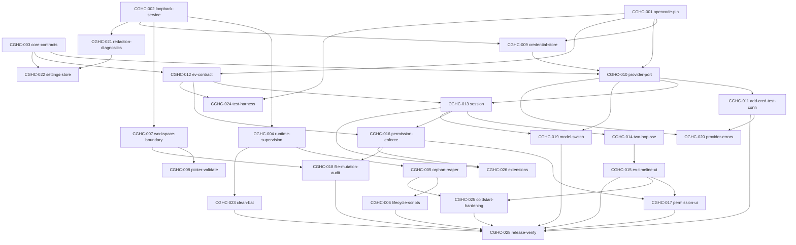

> **Superseded:** This document is historical Claude planning provenance. It is not
> the active source of truth. Use
> [docs/product/cowork-ghc-product-plan.md](./cowork-ghc-product-plan.md) for the
> current product plan. Keep this file for requirement reconciliation only.

# Cowork GHC — Kế hoạch tổng thể (Master Plan)

> Loop L5 là loop **lập kế hoạch (planning)**. Kiến trúc đã **FROZEN ở L4** (ADR
> `0001`–`0006` Accepted; ADR `0007` = web DEFERRED). Tài liệu này chỉ sản xuất **vertical
> slices + task graph + kế hoạch release/test/perf**. Nó **KHÔNG** viết feature/implementation
> code và **KHÔNG** thay đổi bất kỳ ADR đã freeze nào. Mọi identifier kỹ thuật (Requirement ID,
> Task ID, Slice ID, role, ADR, đường dẫn, lệnh) giữ nguyên tiếng Anh theo
> `.claude/rules/documentation.md`.
>
> Nguồn: `docs/product/cowork-ghc-scope-and-acceptance.md` (Requirement baseline L1),
> `docs/architecture/cowork-ghc-implementation-design.md` (design L3/L4),
> `docs/architecture/decisions/0001..0007`, `.claude/rules/testing.md`,
> `.loop-engineer/evidence/L4/review-dispositions.md`,
> `.loop-engineer/evidence/L4/web-readiness-delta.md`.

## 1. Mục tiêu & phạm vi

Mục tiêu POC: một sản phẩm **desktop AI cowork cho Windows 11 local PC**. Người dùng chọn một
thư mục local, trò chuyện với AI agent có thể đọc/sửa file trong thư mục đó **dưới sự cho phép
tường minh (permission)**, dùng **provider key của chính họ**, hoàn toàn trên máy của họ.

Phạm vi được chốt bởi L1 (41 MUST, 15 SHOULD). L5 lập kế hoạch để đạt **toàn bộ MUST** và các
SHOULD vừa ngân sách POC.

Ngoài phạm vi / hoãn:
- **Web application = DEFERRED** theo ADR `0007`. Không tạo `apps/web`, không cài Next.js, không
  mở web loop. Chỉ giữ backlog `CGHC-WEB-001` (không phải task thực thi).
- **OOS1** `ee/` enterprise cloud, **OOS2** remote/multi-user server mode, **OOS3** chat
  connectors — loại trừ tuyệt đối.
- **D1–D4** (dispatch, Microsoft automation, knowledge/RAG, LLM gateway) — chỉ thiết kế **port
  seam boundary**, không build (đã cố định ở design §7).

Invariant kiến trúc bắt buộc tôn trọng (không thương lượng): UI là client của **local service
loopback-only**; business logic không nằm trong UI; **permission enforced tại execution
boundary** (Deny chặn thật trên disk); một source-of-truth cho mỗi loại state; một credential
store; provider-neutral; một owner cho mỗi child-process lifecycle; secret không bao giờ vào
log/error/frontend state/local storage.

## 2. Vertical slices (VS-01..VS-15)

Mỗi slice là một lát cắt dọc có thể demo. Chuỗi VS-01 → VS-10 phủ **toàn bộ E2E critical path**
trong `.claude/rules/testing.md`: `init` → `start` → workspace → provider/model → session →
streaming → plan/todo → permission allow/deny → file-on-disk → `stop` → resume → template →
provider error → `clean`.

### VS-01 — Local service boundary + loopback + client-token
- **Mục tiêu:** dựng Local Application Service standalone (Node) bind **chỉ loopback**
  (`127.0.0.1`/`::1`), thiết lập **per-launch client token** cho renderer/shell/test làm HTTP
  client bình đẳng.
- **Requirements:** P7. **ADR:** 0003.
- **Entry:** repo có scaffold service. **Exit:** service lên, socket chỉ nghe loopback, non-loopback
  bị từ chối; typed boundary client contract có sẵn.
- **Demo:** khởi động service; test kết nối từ non-loopback interface → refused.
- **Tasks:** CGHC-002.

### VS-02 — Process supervision + `.runtime/` + Windows orphan reaper + start/stop scripts
- **Mục tiêu:** một owner cho mỗi child; ghi/đọc `.runtime/pids/*.json` với identity (PID +
  start-time + exePath); **Windows orphan reaper** (LC3); graceful stop (loopback shutdown →
  `taskkill /PID /T /F` hoặc Job Object); `init/start/stop.bat` thin entry → neutral CLI, honest
  exit codes (0/3/9).
- **Requirements:** LC1, LC2, LC3, LC5. **ADR:** 0004.
- **Entry:** VS-01 xong. **Exit:** start.bat lên chuỗi shell+service+child; stop.bat chỉ giết
  process của mình theo identity; stale PID xử lý sạch; double-click từ Explorer chạy đúng.
- **Demo:** double-click `start.bat` → `stop.bat`; kiểm tra không process nào của người khác bị đụng.
- **Tasks:** CGHC-004, CGHC-005, CGHC-006.

### VS-03 — Workspace boundary
- **Mục tiêu:** native folder picker (W1) qua preload bridge; validate path (W3: tồn tại, ghi
  được, spaces + Unicode); **confinement tại boundary** cho mọi op (W4/F4: `..`, absolute escape,
  UNC, symlink escape bị từ chối và ghi audit).
- **Requirements:** W1, W3, W4, F4, W2 (SHOULD). **ADR:** 0002, 0003.
- **Entry:** VS-01. **Exit:** chọn workspace `C:\Users\名前\My Projects (test)` hoạt động; op ngoài
  root bị refuse tại service.
- **Demo:** pick workspace Unicode; thử path traversal → refused + audit.
- **Tasks:** CGHC-007, CGHC-008.

### VS-04 — Provider abstraction + credential store + test connection
- **Mục tiêu:** OpenCode runtime pin + launch/config (RE6); **credential store** duy nhất
  (`@napi-rs/keyring`, Windows Credential Manager) với `CredentialRef` handle + **inject-at-launch
  ENV** (SEC-1, không ghi `auth.json`); `ProviderPort` provider-neutral cho 5 provider
  (Anthropic/OpenAI/Google/OpenRouter/custom OpenAI-compatible) + SSRF policy + test-mode loopback
  allowlist; add credential (PR2) + test connection (PR3).
- **Requirements:** PR1, PR2, PR3, PR9, PR10, RE6. **ADR:** 0001, 0005, 0006.
- **Entry:** VS-01. **Exit:** thêm 1 key vào keyring, test connection báo success/mapped error, key
  không bao giờ echo ra UI/log/state.
- **Demo:** add Anthropic key → test connection PASS; key không hiện ở đâu.
- **Tasks:** CGHC-001, CGHC-009, CGHC-010, CGHC-011.

### VS-05 — Session + two-hop SSE streaming + EV contract + snapshot/resync
- **Mục tiêu:** định nghĩa **EV event model + terminal-state set** (`completed`/`errored`/
  `cancelled`/`denied`), map OpenCode SSE → EV (không fabricate); session create/continue/rename/
  history (S1), cancel (S3), status honest (S6), restore (S4); **two-hop SSE** (runtime→service→
  renderer) với coalescing/backpressure + **snapshot/resync endpoint**; renderer render EV timeline
  (plan/todo EV1, per-step EV2, tool calls EV3, file mutations EV4, error+recovery EV6, không fake
  completed EV7).
- **Requirements:** S1, S2, S3, S6, EV1–EV7. **ADR:** 0001, 0003.
- **Entry:** VS-04. **Exit:** gửi prompt → response stream không block UI; terminal state thật;
  reconnect re-sync authoritative server state (không stale `waiting`/`completed`).
- **Demo:** prompt → streaming + plan/todo; inject mid-task failure → UI không hiện completed.
- **Tasks:** CGHC-012, CGHC-013, CGHC-014, CGHC-015.

### VS-06 — Permission round-trip (Deny blocks + explicit deny reply)
- **Mục tiêu:** approval **origin tại execution boundary** (P1); Allow/Deny UI mô tả action+target
  (P2); **Deny chặn thật trên disk VÀ gửi explicit deny reply** về runtime (không strand runtime),
  đưa session về terminal actionable (P3); bypass UI cũng bị chặn; fail-closed timeout (P6);
  approval level (P4).
- **Requirements:** P1, P2, P3, P6 (P4/F5 SHOULD). **ADR:** 0003.
- **Entry:** VS-05. **Exit:** Deny một file write → file **unchanged on disk** + session reach
  terminal (no hang); gọi service trực tiếp không approval cũng bị chặn.
- **Demo:** yêu cầu write → Deny → xác nhận bytes on disk không đổi.
- **Tasks:** CGHC-016, CGHC-017.

### VS-07 — File-mutation visibility + audit
- **Mục tiêu:** pipeline read/create/edit (F1), delete-with-approval (F3), move/rename (F2), diff/
  mô tả trước khi apply (F5); **verify bytes on disk** (F6); **audit event** cho quyết định quan
  trọng (P5) không chứa secret.
- **Requirements:** F1, F3, F6, P5 (F2/F5 SHOULD). **ADR:** 0003.
- **Entry:** VS-03, VS-06. **Exit:** approve edit → file đổi đúng trên disk + EV4 hiển thị; delete
  không approve → không xóa; audit jsonl ghi nhận.
- **Demo:** agent tạo file → approve → verify on disk; delete → Deny → file còn nguyên.
- **Tasks:** CGHC-018.

### VS-08 — Model config/switch + provider error handling
- **Mục tiêu:** default model + per-session override (PR4); switch provider/model **không restart
  app** (PR5); provider health (PR6); mapped negative-path (invalid key/timeout/HTTP 429/
  unavailable) với recovery action + bounded retries (PR7).
- **Requirements:** PR4, PR5, PR7 (PR6 SHOULD). **ADR:** 0005.
- **Entry:** VS-04, VS-05. **Exit:** đổi model → request kế tiếp dùng model mới; mỗi lỗi provider
  hiện distinct actionable error, không leak secret, không infinite retry.
- **Demo:** đổi model giữa session; inject 429 → UI hiện rate-limit error + retry.
- **Tasks:** CGHC-019, CGHC-020.

### VS-09 — Settings/diagnostics + value-based redaction + scrubbed diagnostics bundle
- **Mục tiêu:** settings general+provider persist qua restart (SD1); recover corrupt settings
  (SD5); model-pref SSOT ở **service settings store** (không localStorage); runtime status (SD2);
  version app+runtime (SD7); **redacted logs** off-by-default verbose (SD3); **scrubber match theo
  VALUE** (PR8), phủ diagnostics bundle + execution-metadata; diagnostics export scrubbed (SD4).
- **Requirements:** PR8, SD1, SD2, SD3, SD7 (SD4/SD5 SHOULD). **ADR:** 0006.
- **Entry:** VS-01, VS-04. **Exit:** một secret đã biết bị scrub ở mọi nơi có thể lộ; version hiển
  thị đúng; verbose logging bật vẫn redact.
- **Demo:** export diagnostics bundle → grep secret → 0 hit.
- **Tasks:** CGHC-021, CGHC-022.

### VS-10 — clean.bat allowlist + cleanup manifest
- **Mục tiêu:** `clean.bat` in đúng danh sách sẽ xóa + confirm (default No, `--yes` cho
  non-interactive); chỉ xóa category `generated`/`downloaded-library`/`runtime-temporary`; refuse
  path chồng `preserve`; refuse khi app đang chạy (exit 4); traversal guard; không xóa protected
  paths.
- **Requirements:** LC4. **ADR:** 0004.
- **Entry:** VS-02. **Exit:** clean xóa đúng generated data; `.git/`, source, docs, credentials,
  workspace, `.loop-engineer/state|checkpoints|evidence` intact.
- **Demo:** tạo generated data → `clean.bat --yes` → chỉ generated bị xóa.
- **Tasks:** CGHC-023.

### VS-11 — Test harness (captured-real-frame fixtures + pin gate)
- **Mục tiêu:** fixtures **captured từ REAL OpenCode SSE boundary** (recorded frames, không bịa);
  re-capture wired vào **ADR 0001 pin/upgrade gate**; provider contract suite scaffold dùng chung
  cho mọi adapter (connect/auth error/model/streaming/timeout/cancel/rate limit/error mapping/
  secret redaction).
- **Requirements:** PR10 (contract), hỗ trợ EV1–EV7. **ADR:** 0001, 0005.
- **Entry:** VS-04, VS-05. **Exit:** contract/integration/EV-reducer test chạy trên real-frame
  fixtures; version bump OpenCode → re-capture bắt buộc; không hollow-green.
- **Demo:** chạy contract suite; bump pin → gate yêu cầu re-capture.
- **Tasks:** CGHC-024.

### VS-12 — Cold-start readiness + crash recovery + renderer hardening
- **Mục tiêu:** **progressive-readiness contract** cho boot multi-process (shell+service+child);
  crashed-child → UI surface + recovery action (không silent hang / fake-ready); **renderer
  hardening checklist** (CSP, `sandbox: true`, `nodeIntegration: false`, `contextIsolation: true`,
  navigation lockdown, no generic IPC passthrough).
- **Requirements:** S6 + design §11. **ADR:** 0002, 0003.
- **Entry:** VS-02, VS-05. **Exit:** boot hiển thị readiness từng bước; kill child → recovery UI;
  renderer pass hardening checklist.
- **Demo:** kill OpenCode child giữa boot → UI báo + offer restart.
- **Tasks:** CGHC-025.

### VS-13 — Runtime extension (SHOULD)
- **Mục tiêu:** một sample skill (RE1); một MCP integration add/remove/enable (RE2); workflow
  template save + re-run — **Cowork-GHC-defined, không kế thừa OpenWork** (RE4); diagnostics cho
  extension fail (RE5).
- **Requirements:** RE1, RE2, RE4, RE5 (SHOULD). **ADR:** 0001, 0005.
- **Entry:** VS-05, VS-06. **Exit:** enable skill + MCP trong session; save template → re-run;
  broken extension hiện diagnostic không crash session.
- **Demo:** save một workflow template → re-run.
- **Tasks:** CGHC-026.

### VS-14 — web-seam core/contracts package (CGHC-ARCH-001)
- **Mục tiêu:** package `core/contracts` shell-neutral tường minh (shared EV, provider, permission,
  workspace, session, `CredentialRef`/`ModelRef` types) + **rule import-direction có kiểm tra**
  (lint/boundary) để `app/ui` và web surface tương lai dùng core mà không import `app/shell`
  (Electron). **Chỉ định nghĩa boundary — không redesign, không build web.**
- **Requirements:** invariant #12 (web-readiness-delta). **ADR:** 0002 (:68-69), 0003.
- **Entry:** VS-01. **Exit:** core package tồn tại; lint chặn import ngược từ app/shell.
- **Demo:** import `app/shell` từ core → lint fail.
- **Tasks:** CGHC-003.

### VS-15 — Documentation normalization (CGHC-DOC-001)
- **Mục tiêu:** chuẩn hóa docs human-facing sang tiếng Việt, giữ identifier tiếng Anh, không đổi
  ngữ nghĩa; ghi `LANGUAGE_ONLY_CHANGE`; chia nhỏ, không rewrite toàn bộ `docs/` một lần.
- **Requirements:** documentation rules. **ADR:** —
- **Entry:** —. **Exit:** canonical docs có nội dung tiếng Việt; ID không bị dịch; Mermaid + link
  intact; cả technical review lẫn language review xong.
- **Demo:** diff LANGUAGE_ONLY_CHANGE cho một canonical doc.
- **Tasks:** CGHC-027.

## 3. Task graph

Owner là một trong `runtime-llm-engineer`, `frontend-desktop-engineer`, `test-engineer`,
`product-architect`. Reviewer **luôn khác owner**; task nhạy cảm bảo mật (credential, permission,
clean.bat, redaction, workspace boundary, loopback token, SSRF, renderer hardening) reviewer là
`security-reviewer`.

| id | requirement | slice | owner | reviewer | priority | dependencies | key acceptance | key tests | risk |
|---|---|---|---|---|---|---|---|---|---|
| CGHC-001 | RE6 | VS-04 | runtime-llm-engineer | code-reviewer | CRITICAL | — | OpenCode pin launch/config; keyless spike xác nhận env-var name per provider | runtime process identity; pin gate | Env-var name không xác định trước binary |
| CGHC-002 | P7 | VS-01 | runtime-llm-engineer | security-reviewer | CRITICAL | — | Service bind chỉ loopback; non-loopback refused; per-launch client token | P7 loopback bind; token non-persistence | Token rò/persistent |
| CGHC-003 | CGHC-ARCH-001 | VS-14 | product-architect | code-reviewer | MEDIUM | — | core/contracts package + import-direction lint | boundary lint test | Over-engineering seam |
| CGHC-004 | LC (ADR 0004) | VS-02 | runtime-llm-engineer | code-reviewer | HIGH | CGHC-002 | `.runtime/pids/*.json` identity PID+start-time+exePath; one owner | PID state parse; runtime identity | Reused PID mis-match |
| CGHC-005 | LC3 | VS-02 | runtime-llm-engineer | security-reviewer | HIGH | CGHC-004 | Windows orphan reaper; graceful stop tree; không kill by name | start/stop orchestration; orphan reaper | Reference sweep Unix-only |
| CGHC-006 | LC1,LC2,LC3,LC5 | VS-02 | runtime-llm-engineer | code-reviewer | HIGH | CGHC-004,CGHC-005 | init/start/stop.bat thin entry; honest exit 0/3/9; `%~dp0` root-independent | exit code; double-click CWD | .bat luôn trả 0 |
| CGHC-007 | W4,F4 | VS-03 | runtime-llm-engineer | security-reviewer | CRITICAL | CGHC-002 | Confinement tại boundary; `..`/UNC/symlink/absolute refused + audit | path allowlist; traversal negative | Symlink/UNC escape |
| CGHC-008 | W1,W3,W2 | VS-03 | frontend-desktop-engineer | code-reviewer | HIGH | CGHC-002,CGHC-007 | Native picker; validate exists/writable/spaces/Unicode; recent list | workspace validation | Unicode/space path |
| CGHC-009 | PR9 | VS-04 | runtime-llm-engineer | security-reviewer | CRITICAL | CGHC-001,CGHC-002 | Keyring single store; CredentialRef handle; inject-at-launch ENV; no auth.json | credential reference; secret redaction | Key rò ra disk/state |
| CGHC-010 | PR1,PR10 | VS-04 | runtime-llm-engineer | security-reviewer | HIGH | CGHC-001,CGHC-003,CGHC-009 | ProviderPort neutral; 5 provider; SSRF block + test-mode allowlist | provider config; contract suite | SSRF qua custom endpoint |
| CGHC-011 | PR2,PR3 | VS-04 | runtime-llm-engineer | security-reviewer | HIGH | CGHC-009,CGHC-010 | Add credential; test connection success/mapped error; no echo key | provider contract connect/auth | Key echo ra UI |
| CGHC-012 | EV1,EV2,EV3,EV7 | VS-05 | runtime-llm-engineer | test-engineer | CRITICAL | CGHC-001,CGHC-003 | EV model + terminal-state set; SSE→EV mapped không fabricate | EV reducer/state machine | Terminal-state contract thiếu |
| CGHC-013 | S1,S3,S6 | VS-05 | runtime-llm-engineer | code-reviewer | HIGH | CGHC-010,CGHC-012 | Create/continue/rename/history; cancel; honest status; restore S4 | session logic; contract mapping | Cancel không dừng mutation |
| CGHC-014 | S2,EV5 | VS-05 | runtime-llm-engineer | ux-performance-reviewer | HIGH | CGHC-012,CGHC-013 | Two-hop SSE coalescing/backpressure; snapshot/resync | streaming lifecycle; resync | Flood UI thread |
| CGHC-015 | EV1,EV2,EV3,EV4,EV6,EV7 | VS-05 | frontend-desktop-engineer | ux-performance-reviewer | HIGH | CGHC-014,CGHC-003 | EV timeline honest; error+recovery; không fake completed | UI↔service; EV7 injected-failure | Fake completed state |
| CGHC-016 | P1,P2,P3,P6 | VS-06 | runtime-llm-engineer | security-reviewer | CRITICAL | CGHC-012,CGHC-013 | Deny block on disk + explicit deny reply; bypass block; fail-closed timeout | permission round trip; Deny F6 | Runtime strand khi Deny |
| CGHC-017 | P2,F5 | VS-06 | frontend-desktop-engineer | ux-performance-reviewer | HIGH | CGHC-016,CGHC-015 | Modal Allow/Deny action+target; diff/description | permission UI; deny mapping | Deny UI-only không chặn |
| CGHC-018 | F1,F3,F6,P5 | VS-07 | runtime-llm-engineer | security-reviewer | CRITICAL | CGHC-007,CGHC-016 | Read/create/edit; delete-with-approval; verify bytes on disk; audit no secret | filesystem mutation; F6 on-disk | Fake mutation success |
| CGHC-019 | PR4,PR5 | VS-08 | runtime-llm-engineer | code-reviewer | HIGH | CGHC-010,CGHC-013 | Default+per-session model; switch không restart; health PR6 | model selection; provider config | Restart-to-switch |
| CGHC-020 | PR7 | VS-08 | runtime-llm-engineer | test-engineer | HIGH | CGHC-010,CGHC-011 | Mapped invalid-key/timeout/429/unavailable; bounded retry; no leak | provider error mapping; negative | Infinite retry / leak |
| CGHC-021 | PR8,SD2,SD3,SD7 | VS-09 | runtime-llm-engineer | security-reviewer | HIGH | CGHC-002 | VALUE-based scrubber phủ bundle+exec metadata; redact stays on; versions | secret redaction; error mapping | Name-only redaction leak |
| CGHC-022 | SD1,SD5 | VS-09 | frontend-desktop-engineer | code-reviewer | MEDIUM | CGHC-021,CGHC-003 | Settings persist; corrupt-tolerant recover; model-pref SSOT service store | corrupt settings; persistence | localStorage SSOT drift |
| CGHC-023 | LC4 | VS-10 | runtime-llm-engineer | security-reviewer | HIGH | CGHC-004 | Allowlist-only delete; confirm/`--yes`; refuse-if-running exit 4; traversal guard | cleanup manifest; path allowlist | Xóa protected path |
| CGHC-024 | PR10 | VS-11 | test-engineer | runtime-llm-engineer | HIGH | CGHC-001,CGHC-012 | Captured real-frame fixtures; re-capture wired pin gate; contract suite | contract suite; fixture pin gate | Hollow-green fictional frames |
| CGHC-025 | S6 (design §11) | VS-12 | frontend-desktop-engineer | security-reviewer | HIGH | CGHC-005,CGHC-015 | Progressive-readiness; crash recovery UX; renderer hardening checklist | health check; restart/resume | Silent hang / weak CSP |
| CGHC-026 | RE1,RE2,RE4,RE5 | VS-13 | runtime-llm-engineer | code-reviewer | MEDIUM | CGHC-013,CGHC-016 | Sample skill; MCP add/remove; template save/re-run; extension diagnostic | MCP lifecycle; template logic | Extension crash session |
| CGHC-027 | CGHC-DOC-001 | VS-15 | product-architect | code-reviewer | MEDIUM | — | Canonical docs tiếng Việt; ID không dịch; LANGUAGE_ONLY_CHANGE | doc language audit | Mistranslate identifier |
| CGHC-028 | LC5 + release | VS-02 | test-engineer | release-verifier | HIGH | CGHC-006,CGHC-011,CGHC-015,CGHC-017,CGHC-018,CGHC-019,CGHC-023,CGHC-025 | Packaging + clean-profile + packaged smoke (incl. provider-error + template + resume legs) + 4 `.bat` double-click E2E | E2E critical path; packaged smoke; provider-error E2E | Dev-server false evidence |

### Mermaid — đồ thị phụ thuộc

CGHC-003, CGHC-027 độc lập (không phụ thuộc), có thể chạy song song sớm.

## 4. Perf budget (mục tiêu số cụ thể)

Đo trên target hardware POC (laptop Windows 11, 8-core, 16GB). Không phải hard gate ở L6 nhưng
verify ở L8/L9.

- **Cold-start (multi-process boot: shell + service + OpenCode child):**
  - Cửa sổ shell hiển thị < **1.5s**.
  - Progressive-readiness indicator xuất hiện < **300ms** (không blank hang).
  - Toàn chuỗi ready (service healthy + OpenCode `/global/health` healthy) < **6s** p95.
- **Streaming latency/coalescing (two-hop runtime→service→renderer):**
  - First token tới UI < **500ms** sau khi runtime phát.
  - Overhead do hop service thêm vào < **50ms** p95.
  - Coalescing flush theo animation frame (~**16–33ms**), tối đa **1 render/frame**; backpressure
    gom batch khi > **60 events/s**; stream không block UI thread.
- **Permission-prompt responsiveness:**
  - Modal xuất hiện < **200ms** sau boundary event.
  - Allow/Deny round-trip (UI → enforce → phản hồi) < **300ms**.
- **Re-render cost:**
  - Token streaming không re-render toàn tree; EV timeline virtualized.
  - < **5ms** main-thread/batch; giữ > **50fps** khi streaming (không dropped frame).

## 5. Release plan (map L6 → L9)

- **L6 — Implementation:** build slices theo task graph; unit test + provider contract test cho
  từng task; evidence dưới `.loop-engineer/evidence/`. Reviewer ≠ implementer mỗi task. Critical
  path (CGHC-001/002/003 READY) chạy trước.
- **L7 — Integration:** UI↔service, service↔runtime, session lifecycle, streaming lifecycle,
  permission round-trip, filesystem mutation, credential reference, MCP lifecycle, persistence,
  restart/resume, process supervisor, health check, start/stop lifecycle, cleanup manifest.
- **L8 — Hardening:** negative tests đầy đủ (invalid/missing key, timeout, 429, network loss,
  runtime won't start, port taken, path traversal, locked file, MCP dead, stream interrupted,
  corrupt settings, orphan child, stale PID, clean-while-running…); redaction-by-value verify;
  perf budget verify; Windows reaper verify.
- **L9 — Release verification:** **packaging** (Electron installer) → cài trên **clean profile** →
  **packaged smoke** trên bản đóng gói (KHÔNG dùng dev server làm evidence) → **4 `.bat`
  double-click** từ Explorer → chạy full E2E critical path trên packaged build; release-verifier
  ký. **Dev server không phải final evidence.**

## 6. Risk register

| # | Risk | Owner | Mitigation |
|---|---|---|---|
| R1 | **Keyless env-name spike:** env-var name per provider (OPENAI/OPENROUTER/GEMINI) không xác định trước binary; sai → provider chain hỏng | runtime-llm-engineer | Spike keyless vào pinned OpenCode (CGHC-001) gated ADR 0001 **trước** khi build provider (CGHC-010/011) |
| R2 | **Windows orphan reaper:** reference sweep chỉ Unix (`runtime.mjs:1072`); orphan/mis-kill process | runtime-llm-engineer + security-reviewer | Identity PID+start-time+exePath re-match; Job Object hoặc `taskkill /T`; test orphan/stale PID (CGHC-005) |
| R3 | **SSRF policy** cho custom OpenAI-compatible endpoint | runtime-llm-engineer + security-reviewer | Production SSRF block; test-mode loopback allowlist dead-code-eliminated + startup hard-assert-off ở release; release negative test (CGHC-010) |
| R4 | **EV contract/terminal-state** chưa đủ → UI honesty vỡ (stale/fake completed) | runtime-llm-engineer | Định nghĩa đầy đủ terminal set; snapshot/resync; captured-real-frame fixtures (CGHC-012/024) |
| R5 | **Redaction-by-value:** name-only match rò value | runtime-llm-engineer + security-reviewer | VALUE-based scrubber; phủ diagnostics bundle + exec-metadata; redact-on khi verbose (CGHC-021) |
| R6 | **Renderer hardening:** renderer render model-generated content | frontend-desktop-engineer + security-reviewer | CSP + sandbox + contextIsolation + nav lockdown + no generic IPC; checklist (CGHC-025) |
| R7 | Two-hop streaming flood UI thread | runtime-llm-engineer + ux-performance-reviewer | Coalescing/backpressure contract; perf budget §4 (CGHC-014) |
| R8 | Standalone-service cold-start cost | runtime-llm-engineer | Progressive-readiness; embedded fallback documented (design §3); cold-start budget §4 |

## 7. Script tasks (init/start/stop/clean.bat)

Tất cả `.bat` là **thin entry** → neutral CLI (`tools/loop-engineer/lifecycle.mjs` +
`tools/loop-engineer/cli.mjs`); self-locate root qua `%~dp0`; **honest exit codes** (0 success/
valid no-op; 3 start not-ready; 4 clean refused app running; 9 Node missing); pause cuối; không
admin; không đổi execution policy; không tải executable chưa verify; không fake success. Mapping
LC1–LC5:
- `init.bat` (LC1) — idempotent, tạo `.runtime/` subdirs, báo thiếu toolchain (exit 9) → **CGHC-006**.
- `start.bat` (LC2) — prompt init nếu chưa; NOT READY exit 3 khi runtime chưa build → **CGHC-006**.
- `stop.bat` (LC3) — chỉ giết tracked process theo identity; stale PID sạch; "nothing running" = 0
  → **CGHC-005, CGHC-006**.
- `clean.bat` (LC4) — allowlist manifest; confirm/`--yes`; refuse-if-running exit 4 → **CGHC-023**.
- Double-click + root-independence + exit codes (LC5) verify trong **CGHC-028**.

## 8. Truy vết requirement → slice → task

| Requirement | Slice | Task(s) |
|---|---|---|
| W1 | VS-03 | CGHC-008 |
| W3 | VS-03 | CGHC-008 |
| W4 | VS-03 | CGHC-007 |
| W2 (SHOULD) | VS-03 | CGHC-008 |
| S1 | VS-05 | CGHC-013 |
| S2 | VS-05 | CGHC-014 |
| S3 | VS-05 | CGHC-013 |
| S6 | VS-05/VS-12 | CGHC-013, CGHC-015, CGHC-025 |
| S4 (SHOULD) | VS-05 | CGHC-013 |
| EV1 | VS-05 | CGHC-012, CGHC-015 |
| EV2 | VS-05 | CGHC-012, CGHC-015 |
| EV3 | VS-05 | CGHC-012, CGHC-015 |
| EV4 | VS-05/VS-07 | CGHC-015, CGHC-018 |
| EV6 | VS-05 | CGHC-015 |
| EV7 | VS-05 | CGHC-012, CGHC-015 |
| EV5 (SHOULD) | VS-05 | CGHC-014 |
| P1 | VS-06 | CGHC-016 |
| P2 | VS-06 | CGHC-016, CGHC-017 |
| P3 | VS-06 | CGHC-016 |
| P5 | VS-07 | CGHC-018 |
| P7 | VS-01 | CGHC-002 |
| P4/P6 (SHOULD) | VS-06 | CGHC-016 |
| F1 | VS-07 | CGHC-018 |
| F3 | VS-07 | CGHC-018 |
| F4 | VS-03 | CGHC-007 |
| F6 | VS-07 | CGHC-018 |
| F2/F5 (SHOULD) | VS-06/VS-07 | CGHC-017, CGHC-018 |
| PR1 | VS-04 | CGHC-010 |
| PR2 | VS-04 | CGHC-011 |
| PR3 | VS-04 | CGHC-011 |
| PR4 | VS-08 | CGHC-019 |
| PR5 | VS-08 | CGHC-019 |
| PR7 | VS-08 | CGHC-020 |
| PR8 | VS-09 | CGHC-021 |
| PR9 | VS-04 | CGHC-009 |
| PR10 | VS-04/VS-11 | CGHC-010, CGHC-024 |
| PR6 (SHOULD) | VS-08 | CGHC-019 |
| RE6 | VS-04 | CGHC-001 |
| RE1/RE2/RE4/RE5 (SHOULD) | VS-13 | CGHC-026 |
| SD1 | VS-09 | CGHC-022 |
| SD2 | VS-09 | CGHC-021 |
| SD3 | VS-09 | CGHC-021 |
| SD7 | VS-09 | CGHC-021 |
| SD4/SD5 (SHOULD) | VS-09 | CGHC-021, CGHC-022 |
| LC1 | VS-02 | CGHC-006 |
| LC2 | VS-02 | CGHC-006 |
| LC3 | VS-02 | CGHC-005, CGHC-006 |
| LC4 | VS-10 | CGHC-023 |
| LC5 | VS-02 | CGHC-006, CGHC-028 |
| CGHC-ARCH-001 | VS-14 | CGHC-003 |
| CGHC-DOC-001 | VS-15 | CGHC-027 |

**Mọi MUST (41) đều xuất hiện trong ≥ 1 task.** DEFERRED (W5, D1–D4) và OOS1–3 không có task
(đúng chủ ý); web = DEFERRED giữ ở backlog `CGHC-WEB-001`.
