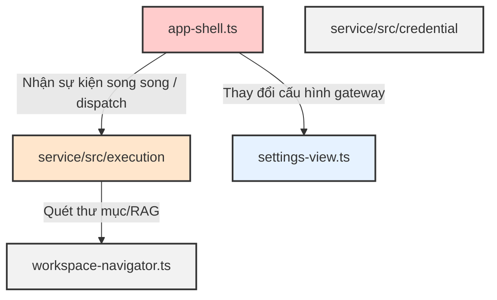

# Cowork GHC Comprehensive Project Audit

## 1. Executive Verdict

Dự án Cowork GHC ở nhánh `bc3518f` là một POC packaged Windows desktop có nền tảng an toàn dữ liệu, ranh giới tiến trình (process boundary) và hệ thống cấp quyền (permission model) rất vững chãi. Tuy nhiên, sản phẩm đang đối mặt với các vấn đề kỹ thuật nghiêm trọng ở lớp giao diện người dùng (UI) và tính không ổn định của quy trình kiểm thử trực tiếp (live integration tests).

**Verdict:**
`Proceed after small fixes`
Dự án đủ điều kiện để đi tiếp, nhưng bắt buộc phải thực hiện tái cấu trúc một phần lớp giao diện UI (Partial Refactor) và áp dụng bộ kiểm thử tĩnh (Deterministic Mock Gateway) cho các hành trình phức tạp trước khi bắt đầu tích hợp song song các phân hệ lớn D1–D4.

---

## 2. Repository Metrics (Inventory)

Thống kê tệp tin được theo dõi (tracked files) trong Git repository hiện tại:

### Tổng quan
*   **Tổng số tệp tin tracked:** 1,227 tệp.
*   **Tệp tin mã nguồn chính (không tính generated/tests):** 285 tệp.
*   **Tệp tin kiểm thử (tests):** 117 tệp.
*   **Tệp tin tài liệu (docs):** 37 tệp.
*   **Tệp tin cấu trúc bổ trợ (schemas/docx/xsd):** 234 tệp (nằm trong thư mục hỗ trợ kỹ năng `.agents/skills/docx`).

### Phân rã theo Layer/Package
*   **Local Service (`service/src`):** 170 tệp (chiếm tỷ trọng logic lớn nhất).
*   **Local Service Tests (`service/tests`):** 102 tệp (đảm bảo độ phủ kiểm thử unit tốt).
*   **Electron UI (`app/ui/src`):** 39 tệp.
*   **Electron UI Tests (`app/ui/tests`):** 25 tệp.
*   **Electron Shell (`app/shell/src`):** 27 tệp.
*   **Electron Shell Tests (`app/shell/tests`):** 16 tệp.
*   **Core Contracts (`core/contracts/src`):** 18 tệp.
*   **Agent Runtime (`runtime/src`):** 14 tệp.
*   **Verification Tooling (`tools/verify`):** 37 tệp.

### Tệp tin lớn nhất
*   **Hình ảnh báo cáo:** `reports/ui-v2/cowork-ghc-current-status-report-1920.png` (272.5 KB).
*   **Mã nguồn JSON:** `package-lock.json` (256.7 KB).
*   **Tệp tin mã nguồn JavaScript/TypeScript:**
    1.  `app/ui/src/styles.css` (2,081 dòng, 42.6 KB).
    2.  `app/ui/src/app-shell.ts` (1,921 dòng, 75.1 KB).
    3.  `tools/verify/file-review-packaged.mjs` (1,155 dòng, 48.0 KB).

---

## 3. Large-File Findings

Các tệp nguồn có độ dài trên 400 dòng được phân tích chi tiết dưới đây:

| Đường dẫn tệp | Độ dài (dòng) | Chức năng chính | Số trách nhiệm | Lý do dài | Khuyến nghị xử lý | Rủi ro khi D1–D4 merge | Dependency chính |
|---|---|---|---|---|---|---|---|
| `app/ui/src/styles.css` | 2,081 | Quản lý toàn bộ CSS của ứng dụng. | 1 | Chứa định nghĩa kiểu dáng của tất cả các component mà không dùng tiền xử lý (Sass/Less) hay Tailwind. | **Chia nhỏ:** Chia nhỏ thành các file module CSS (như `sidebar.css`, `timeline.css`, `composer.css`) và import chung qua một file index. | Low. Chỉ liên quan đến giao diện. | Không có. |
| `app/ui/src/app-shell.ts` | 1,921 | Khởi tạo DOM, quản lý State, điều phối giao tiếp qua bridge và router. | > 10 | Đóng vai trò là "God Object" điều hướng toàn bộ sự kiện: xử lý stream, kiểm soát watchdog, quản lý trước/sau snapshot, xử lý file review, và modal settings. | **Chia nhỏ bắt buộc:** Tách thành các lớp quản lý con độc lập: `TimelineRenderer`, `WatchdogController`, `SettingsPanelController`, `ComposerController`. | **Critical.** Bất kỳ thay đổi nào từ D1-D4 ở core logic đều có thể gây xung đột mã (conflict) tại đây. | `bridge.ts`, `service-client.ts` |
| `tools/verify/file-review-packaged.mjs` | 1,155 | Bộ kiểm thử E2E tích hợp giao diện. | 5 | Chứa kịch bản chạy 12 hành trình kiểm thử (A-L), kiểm tra CDP, khởi chạy Electron và quản lý vòng đời tiến trình. | **Giữ nguyên:** Bản chất là một file script chạy tuyến tính phục vụ kiểm thử. Cần tối ưu hóa các hàm kiểm tra đĩa cứng. | Low. Chỉ chạy ở môi trường test. | `mock-llm-gateway.mjs` |
| `app/ui/src/service-client.ts` | 648 | Client HTTP wrapper giao tiếp với Service. | 1 | Khai báo toàn bộ kiểu dữ liệu (types) của API và các cuộc gọi endpoint. | **Giữ nguyên:** Chỉ đóng vai trò khai báo giao tiếp API. | Medium. Cần cập nhật khi D1-D4 thay đổi API endpoint. | `@cowork-ghc/contracts` |
| `tools/verify/attachment-honesty-packaged.mjs` | 493 | Bộ kiểm thử E2E tính trung thực tệp đính kèm. | 1 | Quản lý kiểm thử luồng attachments. | **Giữ nguyên:** Dành riêng cho kiểm thử. | Low. | `packaged-launch-env.mjs` |
| `app/ui/src/activity-panel.ts` | 462 | Quản lý hiển thị Timeline & File changes ở cột phải. | 4 | Xử lý tương tác nhấp chuột hiển thị Preview, Diff và quản lý DOM của Tabs cột phải. | **Chia nhỏ:** Tách phần render preview và phần timeline riêng. | Medium. | `app-shell.ts` |
| `app/ui/src/activity-model.ts` | 430 | Chuẩn hóa sự kiện và dịch nhãn tiếng Việt. | 2 | Khai báo logic gộp sự kiện, chuẩn hóa đường dẫn tương đối bao gồm xử lý Windows 8.3. | **Giữ nguyên:** Tập trung vào model dữ liệu. | Medium. Cần bổ sung các loại sự kiện mới của D1-D4. | `@cowork-ghc/contracts` |

---

## 4. Dead and Unused Code Findings

Qua phân tích tĩnh các imports và lịch sử các commits, chúng tôi phân loại các đoạn code dư thừa/stale:

### Confirmed Unused (Cần dọn dẹp)
*   **Tệp verifier cũ:** `tools/verify/slice2-workspace-packaged.mjs`, `tools/verify/slice3-provider-packaged.mjs`, `tools/verify/slice4-session-packaged.mjs`, `tools/verify/session-management-packaged.mjs`. Các file này được sinh ra trong các chặng phát triển slice cũ, nay đã được thay thế hoàn toàn bởi các bộ verifier gom nhóm mới.
*   **Tệp lịch sử Wave C:** `tools/verify/run-wave-c.mts`, `tools/verify/leg1-live-critical-path.mts`, `tools/verify/leg2-provider-error.mts`, `tools/verify/leg3-template-resume.mts`, `tools/verify/leg4-product-boundary.mts` cùng file báo cáo `tools/verify/leg4-report.json`. Đây là các dấu vết của subagent Wave C cũ, không còn được gọi bởi bất kỳ script tự động nào.

### Probably Unused (Cần đánh giá thêm)
*   **Vết seam cũ:** `tools/verify/file-review-live-packaged.mjs` và `tools/verify/file-review-deterministic-packaged.mjs`. Mặc dù vẫn hoạt động như các wrapper cài đặt biến môi trường cho `file-review-packaged.mjs`, việc này có thể gộp trực tiếp thông qua đối số dòng lệnh `--mode` của tệp tin chính.

### Still Active (Giữ lại)
*   `tools/verify/mock-llm-gateway.mjs` — Công cụ mô phỏng gateway để chạy kiểm thử deterministic.
*   `tools/verify/release-regression.mjs` — Kịch bản chạy regression chính của CI/CD.

---

## 5. Architecture Risk Map

Ứng dụng hiện tại có sự phân tách ranh giới (boundary) khá rõ ràng ở các phần:
*   **Ranh giới tiến trình (Process boundary):** Electron main quản lý vòng đời local service, OpenCode chạy độc lập dưới dạng child-process.
*   **Bảo mật dữ liệu nhạy cảm (Keyring boundary):** Keyring API được tích hợp qua native msvc bindings, chỉ lưu trữ ở Windows Credential Manager.

Tuy nhiên, có một số điểm **leak kiến trúc** nghiêm trọng:
1.  **State Machine của File Review nằm ở UI:** Logic thu thập dữ liệu before-snapshot khi bắt đầu tool call và so khớp after-snapshot khi có sự kiện `file_mutation` đều do UI điều phối (`app-shell.ts`). Nếu người dùng tắt ứng dụng hoặc UI bị crash giữa turn, các snapshot tạm thời này sẽ mất, gây lỗi khi tạo artifact review sau khi khởi động lại.
2.  **watchdog nằm ở UI:** Stream watchdog (90s) chạy ở tầng renderer. Nếu UI bị đóng băng (due to heavy DOM render), watchdog có thể kích hoạt sai hoặc không hoạt động.

### Risk Map đối với tích hợp D1-D4:

*   **Critical Merge Hotspot:** `app-shell.ts` (Nơi giao nhau của tất cả các dòng sự kiện và quản lý DOM).
*   **High Risk:** `service/src/execution/` (Quản lý luồng thực thi OpenCode và lưu trạng thái lượt chạy).
*   **Medium Risk:** `settings-view.ts` / `llm-settings-panel.ts` (Sẽ thay đổi lớn khi gateway D4 hỗ trợ nhiều model/profile).
*   **Low Risk:** `workspace-navigator.ts` và `service/src/credential/`.

---

## 6. D1–D4 Merge Readiness

Đánh giá mức độ sẵn sàng tích hợp của 4 phân hệ song song (D1-D4):

### D1 — Dispatch / Fan-out
*   **Khả năng conflict:** Xung đột rất cao với mô hình `ConversationRecord` hiện hành (vốn chỉ giả định 1 turn = 1 session chạy tuần tự).
*   **Biện pháp cần thiết:** Cần freeze API của `EvEvent` và tạo adapter thu thập (aggregate) kết quả từ nhiều sub-agent trước khi báo về UI.
*   **Sẵn sàng:** `Low` (Yêu cầu tái cấu trúc Database Schema của service để hỗ trợ quan hệ 1-n giữa Turn và Sub-task).

### D2 — Microsoft Automation
*   **Khả năng conflict:** Xung đột trung bình ở tầng Credential.
*   **Biện pháp cần thiết:** Thêm các tool định nghĩa mới cho Graph API; tạo màn hình xác thực riêng của Microsoft OAuth 365.
*   **Sẵn sàng:** `Medium` (Tầng keyring của service đã hỗ trợ tốt việc lưu trữ thêm token).

### D3 — Knowledge / RAG
*   **Khả năng conflict:** Thấp.
*   **Biện pháp cần thiết:** Tận dụng interface read-only của `WorkspaceNavigator` để hiển thị trạng thái lập chỉ mục (Indexing Status) và sơ đồ Graph liên kết.
*   **Sẵn sàng:** `High` (Workspace Navigator đã được viết dưới dạng service-driven).

### D4 — Advanced LLM Gateway
*   **Khả năng conflict:** Xung đột trung bình ở settings.
*   **Biện pháp cần thiết:** Xóa bỏ phần config DeepSeek-only ở UI, thay thế bằng cơ chế đăng ký Profile cấu hình động.
*   **Sẵn sàng:** `High` (Service router đã tách biệt phần `settings-router.ts`).

---

## 7. Documentation Staleness

Đánh giá tính chính xác của tài liệu trong thư mục `docs/`:

### Phân loại tài liệu
*   **Canonical Active (Sách hướng dẫn chuẩn):**
    *   `docs/product/cowork-ghc-product-plan.md`
    *   `docs/architecture/system-overview.md`
    *   `docs/quality/poc-acceptance.md`
    *   `docs/quality/known-limitations.md`
*   **Active Supporting Document (Tài liệu bổ trợ):**
    *   `docs/product/productization-roadmap.md`
    *   `docs/product/current-status.md`
    *   `docs/architecture/cowork-ghc-implementation-design.md`
    *   `docs/quality/file-review-packaged-triage.md`
    *   `docs/quality/file-review-independent-review.md`
*   **Historical/Superseded (Lịch sử - Không dùng nữa):**
    *   `docs/product/cowork-ghc-master-plan.md`
    *   `docs/product/cowork-ghc-scope-and-acceptance.md`
    *   `docs/product/product-ux-gap-audit.md` (Do giao diện shell mới đã được cài đặt hoàn tất).
*   **Reference (Tài liệu tham khảo):**
    *   `docs/references/cowork-frontend-design-assessment.md`
    *   `docs/references/coworklocalallos3-capability-audit.md`
    *   `docs/references/openwork-requirements-and-basic-design.md`

### Sai lệch thông tin (Claims vs Code)
*   **Skills:** Tài liệu ghi nhận hệ sinh thái Skills đã sẵn sàng, nhưng thực tế chỉ hỗ trợ chế độ instruct-only snapshot (Phase 1), hoàn toàn chưa có executable plugins hay MCP.
*   **Workspace Navigator:** Được ghi nhận là đang phát triển, nhưng thực tế mã nguồn đã cài đặt xong tính năng đọc cây thư mục read-only và bộ lọc cơ bản.

---

## 8. Verification and Test Strategy

Hệ thống kiểm thử hiện tại có tỷ lệ phủ tốt nhưng phân bổ chưa tối ưu:

*   **Thời gian chạy:** Các bài test E2E trực tiếp (`live-mode`) tiêu tốn quá nhiều thời gian (trên 3 phút) và phụ thuộc nặng nề vào phản hồi không xác định của LLM (DeepSeek).
*   **Giải pháp:** Áp dụng chiến lược ba tầng rõ rệt:
    1.  **Per-change (Fast):** `npm run typecheck && npm run test` (Không build package, chạy các tệp unit test tại chỗ trong < 5s).
    2.  **Per-integration-track (Contract):** `node tools/verify/release-regression.mjs` (Xác thực API schema và mock gateway không mạng).
    3.  **Milestone/Release (Full):** Chạy `npm run package:win` tiếp theo là chạy E2E với cổng mock gateway (`--mode deterministic`) và 2 kịch bản live smoke tối giản.

---

## 9. Packaged UI and UX Assessment

### Phân tích giao diện đóng gói (Packaged UI)
1.  **Expanded Layout (Bố cục mở rộng):**
    *   *Ưu điểm:* Vùng hội thoại chính có diện tích hiển thị code block tốt.
    *   *Nhược điểm:* Việc hiển thị các card Chờ tích hợp D1-D4 ở các tab chiếm diện tích quá lớn nhưng không mang lại giá trị tương tác (mật độ thông tin cực thấp). Cột hiển thị file thay đổi bên phải bị kéo dài vô lý khi không có file mutation nào được chọn.
2.  **Collapsed Layout (Bố cục thu nhỏ):**
    *   *Nhược điểm nghiêm trọng:* Khi nhấp thu nhỏ cột phải (`.right-panel--collapsed`), chiều rộng cột chuyển về `58px`. Tuy nhiên, phần tiêu đề text `"Hoạt động & Tệp"` trong header không bị ẩn đi, dẫn đến việc chữ bị vỡ dòng, đè lên nút toggle và tràn ra ngoài biên rất mất thẩm mỹ.

### Đánh giá 3 lựa chọn kiến trúc UI
*   **Lựa chọn A: Polish giao diện cũ:** Chi phí thấp nhưng không giải quyết được mã nguồn monolithic của `app-shell.ts` và dễ gây lỗi vỡ layout khi tích hợp D1-D4.
*   **Lựa chọn B: Refactor một phần (Partial Refactor) [Khuyến nghị]:** Tách nhỏ `app-shell.ts` thành các component độc lập (như SettingsModal, Sidebar, Composer). Sửa lại hệ thống CSS grid để việc collapse cột phải giải phóng không gian thực tế (0px hoặc ẩn hoàn toàn thay vì cố định 58px kèm text lỗi).
*   **Lựa chọn C: Viết lại toàn bộ Shell:** Rủi ro quá cao, tốn thời gian và dễ làm hỏng các luồng sự kiện SSE/watchdog đang hoạt động ổn định.

---

## 10. Top 10 Risks

1.  **Monolithic app-shell.ts (Critical):** Gây xung đột mã nguồn (merge conflicts) cực lớn khi tích hợp đồng thời các nhánh D1-D4.
2.  **UI-Driven File Review State (High):** Việc lưu trữ snapshot trước/sau tạm thời trong bộ nhớ UI dẫn đến mất dữ liệu review nếu ứng dụng bị khởi động lại giữa turn.
3.  **watchdog chạy ở UI (High):** Dễ gây phán đoán sai luồng bị đứt (timeout) nếu renderer thread bị nghẽn.
4.  **Vỡ giao diện khi Collapsed (High):** Tiêu đề cột phải bị đè chữ và tràn khung khi panel ở trạng thái thu nhỏ.
5.  **Flaky Live Verifier (Medium):** Journey C kiểm thử live bằng DeepSeek thường xuyên thất bại do mô hình chọn sai công cụ, che giấu các lỗi thật của sản phẩm.
6.  **Xung đột database schema khi merge D1 (Medium):** Phân hệ Dispatch yêu cầu chạy song song nhiều turn con, xung đột với thiết kế 1-1 của turn-planner hiện tại.
7.  **Quản lý cấu hình Settings cứng (Medium):** Hiện cấu hình model/provider bị gắn chặt với DeepSeek, cản trở việc tích hợp D4 gateway.
8.  **Độ trễ I/O đĩa cứng (Low):** Tạo snapshot trước/sau có thể lấy sai nội dung nếu OpenCode chưa flush dữ liệu xuống đĩa hoàn tất (đã xử lý tạm thời bằng 6 lần retry trì hoãn).
9.  **Tệp verifier rác (Low):** Các tệp tin test cũ không dùng nữa gây loãng mã nguồn.
10. **Thiếu tooltip trên Product Rail (Low):** Gây khó khăn cho trải nghiệm người dùng khi thu nhỏ sidebar.

---

## 11. Top 10 Recommended Actions

1.  **Tái cấu trúc giao diện một phần (Partial Refactor UI):** Tách nhỏ `app-shell.ts` thành các module con.
2.  **Sửa lỗi CSS Collapsed:** Đảm bảo khi thu nhỏ cột phải, toàn bộ header text được ẩn hoàn toàn và kích thước cột được co gọn sạch sẽ.
3.  **Chuyển giao việc quản lý Snapshot về Service:** Để service lưu trữ các snapshot trước/sau tạm thời thay vì UI để tránh mất trạng thái khi crash hoặc reload.
4.  **Chuyển watchdog về Service:** Di tản luồng giám sát thời gian phản hồi về phía service chạy dưới Node.js.
5.  **Dọn dẹp tệp verifier rác:** Xóa bỏ hoặc đưa các tệp kiểm thử cũ (như `leg1-leg4`) vào lưu trữ để làm sạch repository.
6.  **Áp dụng Mock LLM Gateway cho E2E:** Chuyển đổi toàn bộ kiểm thử hành trình C-L của File Review sang chế độ `deterministic` để loại bỏ sự bất định của live LLM.
7.  **Thiết lập quy trình kiểm thử 3 tầng:** Tách biệt phân nhóm chạy test nhanh (local unit test) và chạy chậm (packaged releases).
8.  **Cải tiến cấu hình Model linh hoạt:** Chuẩn bị sẵn cấu hình UI cho phép đổi base URL và tên model tự động để đón đầu D4.
9.  **Bổ sung Tooltips:** Thêm nhãn tooltip cho tất cả các nút icon trên thanh product rail khi sidebar thu nhỏ.
10. **Tách biệt CSS:** Chia tách file `styles.css` siêu lớn thành các file module CSS tương ứng với các component UI.
